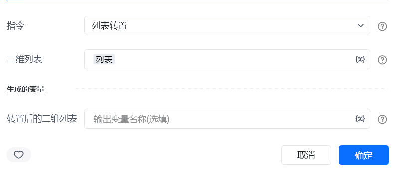
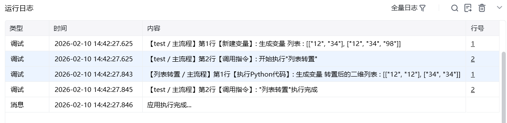

## 一、指令概述

用于将二维列表的 “行” 与 “列” 进行互换（即矩阵转置），适用于数据格式调整场景，可解决表格数据行列方向不匹配的问题，便于后续按列统计、导出等操作。

## 二、调用参数配置参数名称配置说明约束规则二维列表待转置的二维列表（如[["姓名", "张三"], ["年龄", 25]]）必填；需为包含子列表的二维结构，子列表长度需一致生成的变量存储转置后二维列表的变量名称必填；用于承接输出结果，供下游指令调用
## 三、输出说明

## 四、典型操作示例
示例：调整报表数据的行列方向配置 “二维列表”：输入报表数据[["订单ID", "001", "002"], ["金额", 100, 200]]；配置 “生成的变量”：命名为transposed_report；执行指令后，transposed_report变量存储结果为[["订单ID", "金额"], ["001", 100], ["002", 200]]，可直接用于表格导出。

<Info>
  使用指令过程中遇到问题？前往 [八爪鱼RPA 开发者社区问答板块](https://rpa.bazhuayu.com/community/questions) 提问，获取官方与社区帮助。
</Info>
