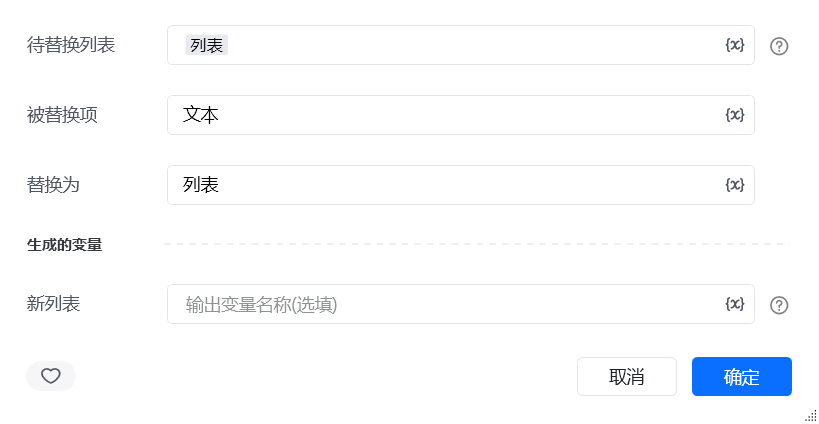
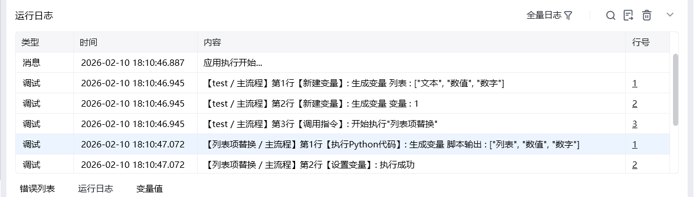

## 一、指令概述

用于将列表中指定的 “被替换项” 统一替换为新内容，适用于数据内容修正、格式统一等场景，可快速批量更新列表中的目标元素，提升数据一致性。

## 二、调用参数配置参数名称配置说明约束规则待替换列表需处理的目标列表（如["待发货", "已完成", "待发货"]）必填；支持任意类型的一维列表被替换项要被替换的目标元素（如待发货）必填；需与列表中的元素类型、内容完全匹配替换为替换后的新内容（如处理中）必填；类型需与被替换项一致（如原项是字符串，新内容也需为字符串）生成的变量存储替换后新列表的变量名称必填；用于承接输出结果，供下游指令调用
## 三、输出说明

## 四、典型操作示例
示例：统一用户状态名称配置 “待替换列表”：输入["正常", "禁用", "正常", "异常"]；配置 “被替换项”：输入：异常；配置 “替换为”：输入：禁用；配置 “生成的变量”：命名为unified_status_list；执行指令后，unified_status_list变量存储结果为["正常", "禁用", "正常", "禁用"]，可用于用户状态统计。

<Info>
  使用指令过程中遇到问题？前往 [八爪鱼RPA 开发者社区问答板块](https://rpa.bazhuayu.com/community/questions) 提问，获取官方与社区帮助。
</Info>
