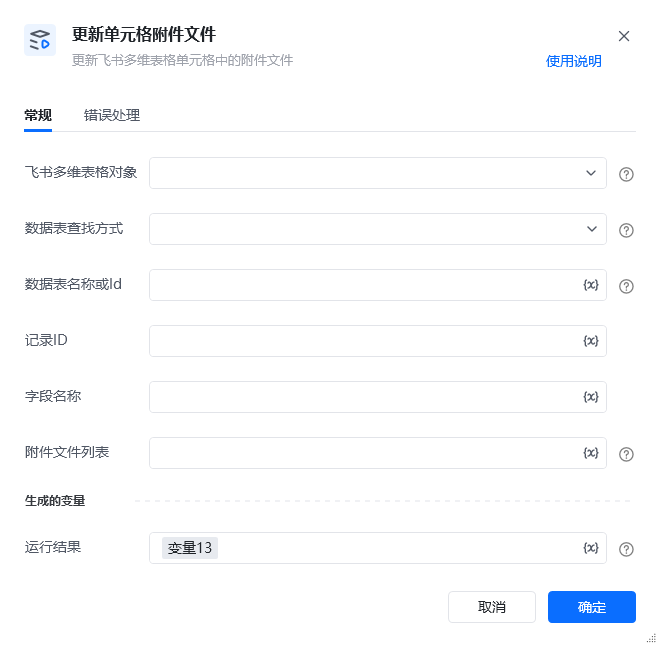
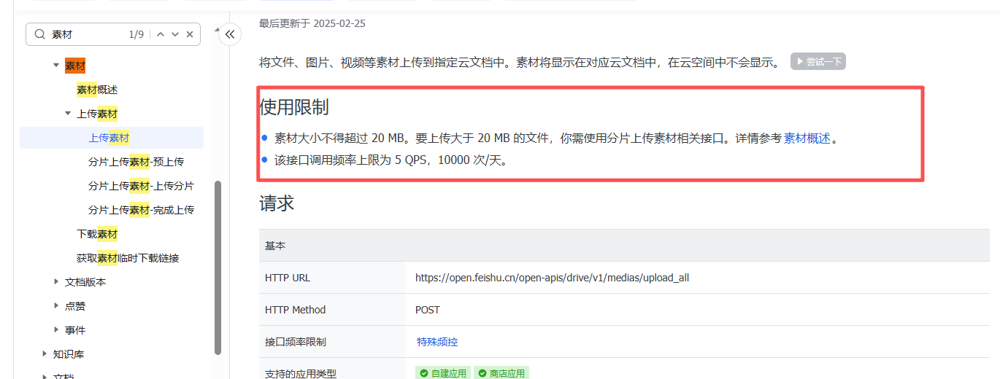

## 1. 功能说明

该 RPA 指令用于更新飞书多维表格中指定记录、指定附件类型字段的单元格附件，支持通过<strong>表名称 / 表 ID</strong>定位数据表、通过<strong>文件 token 列表</strong>设置附件，底层调用飞书多维表格 Open API 完成操作，是飞书多维表格附件维护的核心指令。

## 2. 配置参数

参数名必填说明<strong>飞书多维表格对象</strong>是选择流程中已初始化的飞书多维表格对象<strong>数据表查找方式</strong>是选择数据表定位方式，可选「名称」/「ID」<strong>数据表名称或 Id</strong>是根据「数据表查找方式」填写对应值：表名称（精准匹配）或数据表ID<strong>记录 ID</strong>是目标数据行的唯一标识record_id，用于精准定位待更新的行<strong>字段名称</strong>是待更新的附件类型字段名称（精准匹配），该字段需为飞书多维表格「附件」类型<strong>附件文件列表</strong>是每一个列表项为一个文件路径<strong>运行结果</strong>是定义变量名，用于存储指令执行的完整返回结果（字典格式），供后续流程判断 / 解析

<strong>返回结果说明</strong>

指令执行后返回<strong>标准字典格式</strong>结果，分<strong>执行成功</strong>和<strong>执行失败</strong>两种情况，字段说明如下：
### 执行成功（success: True）

\{
"success": True,
"data": \{
"record_id": "recxxxxxx",  # 被更新的记录ID
"revision": 2,             # 记录更新版本号
# 其他飞书API返回的原始数据
\}
\}
### 执行失败（success: False）

根据错误类型返回不同code和详细信息，包含以下常见场景：# 场景1：按名称查找数据表失败
\{
"success": False,
"code": -10,
"msg": "未找到指定名称的数据表：客户信息表",
\}

# 场景2：飞书API接口返回错误（如无权限、字段不存在）
\{
"success": False,
"code": 9999,  # 飞书API原始错误码
"msg": "字段类型错误，不支持附件更新",  # 飞书API原始错误信息
"log_id": "logxxxxxx",  # 飞书API请求日志ID（用于问题排查）
"raw_response": "\{\}"    # 飞书API原始响应内容（JSON字符串）
\}

# 场景3：HTTP请求错误（如网络异常、接口地址错误）
\{
"success": False,
"code": -1,
"msg": "HTTP请求错误: 404 Client Error: Not Found for url: xxx",
"raw_response": "404 Not Found"
\}

# 场景4：响应解析失败（非JSON格式）
\{
"success": False,
"code": -2,
"msg": "响应不是有效的JSON格式",
"raw_response": "<html>403 Forbidden</html>"
\}

# 场景5：未知运行错误（如变量未定义、空值异常）
\{
"success": False,
"code": -3,
"msg": "未知错误: 'NoneType' object has no attribute 'get'"
\}

### 核心返回字段通用说明字段名类型说明success布尔值指令执行总结果：True = 成功，False = 失败code整型错误码：0 为飞书 API 成功（封装后无此值），-1~-3 为本地执行错误，-10 为表名转 ID 失败，其他为飞书 API 原始错误码msg字符串错误信息描述，成功时无此字段data字典成功时返回飞书 API 的原始数据，失败时无此字段log_id字符串飞书 API 请求日志 ID，仅飞书 API 报错时返回raw_response字符串原始响应内容，仅 HTTP/JSON 解析 / 飞书 API 报错时返回
## 3.  使用示例
### 配置场景

更新飞书多维表格中「客户信息表」（表名称）、rec12345678记录、「合同附件」字段的附件，附件文件为d:/rpa/file123.docx和d:/rpa/file456.xlsx，将运行结果存入变量update_attach_result。

配置步骤「飞书多维表格对象」：选择流程中已创建的飞书对象；「数据表查找方式」：选择「名称」；「数据表名称或 Id」：输入客户信息表；「记录 ID」：输入rec12345678；「字段名称」：输入合同附件；「附件文件列表」：输入带有2个文件路径的文本列表变量名；「运行结果」：输入变量名 update_attach_result。
### 执行结果解析
#### 成功场景

update_attach_result变量值：\{
"success": True,
"data": \{
"record_id": "rec12345678",
"revision": 3,
"fields": \{"合同附件": [\{"file_token": "file123"\}, \{"file_token": "file456"\}]\}
\}
\}
#### 失败场景（示例：字段名称错误）

update_attach_result变量值：\{
"success": False,
"code": 10022,
"msg": "field not found",
"log_id": "log78901234",
"raw_response": "\{\"code\":10022,\"msg\":\"field not found\",\"log_id\":\"log78901234\"\}"
\}
4. 注意事项若目标单元格已有附件，执行该指令会<strong>直接替换原有附件</strong>；「数据表名称」需<strong>精准匹配</strong>，包含空格、中英文标点等，不可多 / 少字符；飞书多维表格对象需应用需拥有该表格的「编辑」权限；单文件最大支持：20MB，超过20MB会走分片上传路径这个每天有限制次数：每日调用次数上限：10000 次 / 天并且QPS（每秒请求数）上限：5 次 / 秒

<Info>
  使用指令过程中遇到问题？前往 [八爪鱼RPA 开发者社区问答板块](https://rpa.bazhuayu.com/community/questions) 提问，获取官方与社区帮助。
</Info>
