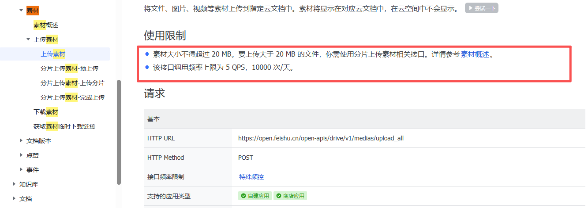

将文件、图片、视频等素材上传到指定多维表格中。

相关飞书官方说明文档： https://open.feishu.cn/document/server-docs/docs/drive-v1/media/upload_all[https://open.feishu.cn/document/server-docs/docs/drive-v1/media/upload_all](https://open.feishu.cn/document/server-docs/docs/drive-v1/media/upload_all)
注意事项：单文件最大支持：20MB，超过20MB会走分片上传路径这个每天有限制次数：每日调用次数上限：10000 次 / 天并且QPS（每秒请求数）上限：5 次 / 秒

<Info>
  使用指令过程中遇到问题？前往 [八爪鱼RPA 开发者社区问答板块](https://rpa.bazhuayu.com/community/questions) 提问，获取官方与社区帮助。
</Info>
