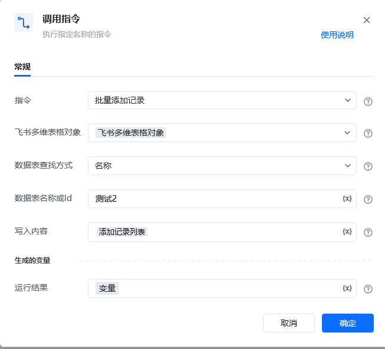

## <strong>一、指令概述</strong>

该 RPA 指令用于向<strong>飞书多维表格</strong>批量添加记录，支持通过「名称」或「Id」定位目标数据表，将结构化数据（<strong>以列表数据集格式</strong>）写入表中，并返回运行结果供后续流程校验，适用于库存、客户信息等批量数据的自动化录入场景。
## <strong>二、调用参数配置示意</strong>

参数名称示例 / 默认值说明指令批量添加记录固定选择 “批量添加记录”，执行飞书多维表格批量添加记录操作。飞书多维表格对象飞书多维表格对象选择已创建 / 关联的飞书多维表格实例对象（需提前通过《连接飞书多维表格》指令获取多维表格对象）。数据表查找方式名称 / Id选择定位目标数据表的方式：- 「名称」：通过数据表名称查找；- 「Id」：通过数据表唯一 Id查找，Id查找方式见飞书官方开发文档数据表名称或 Id测试2 / tbl_xxx123根据 “数据表查找方式”，输入目标数据表的名称或Id，支持变量（界面显示 “\{x\}” 标识）。写入内容 [        \{            "单号": "OD-20250928-001",            "单选": "通过",            "日期": 1753708800000,            "附件": [],            "复选框": True        \},        \{            "单号": "OD-20250928-003",            "单选": "通过",            "日期": 1753708800000,            "附件": [],            "复选框": False        \}    ]写入数据格式参考示例内容，如日期为时间戳、复选框为布尔值。更多数据支持类型请查看飞书官方文档：https://open.feishu.cn/document/server-docs/docs/bitable-v1/app-table-record/batch_create，支持变量。生成的变量 - 运行结果变量（自定义变量名）存储指令执行结果，字典类型
## <strong>三、返回结果说明</strong>

指令执行后，会生成包含操作结果的 JSON 数据（关键敏感参数已掩码），示例：

\{ "success": true, "data": \{ "records": [ \{ "fields": \{ "单号": "OD-20250928-001", "单选": "通过", "日期": 1753708800000, "附件": [], "复选框": true \}, "id": "****************", // 记录唯一标识（已掩码） "record_id": "****************" // 记录唯一ID（已掩码） \}, \{ "fields": \{ "单号": "OD-20250928-003", "单选": "通过", "日期": 1753708800000, "附件": [], "复选框": false \}, "id": "****************", // 记录唯一标识（已掩码） "record_id": "****************" // 记录唯一ID（已掩码） \} ] \}, "record_ids": [ "****************", // 记录ID列表（已掩码） "****************" // 记录ID列表（已掩码） ], "used_table_id": "****************" // 数据表唯一ID（已掩码）\}

各字段含义：

• success：布尔值，true 表示添加成功，false 表示失败。

• data：详细记录信息：

◦ records：数组，包含每条新增记录的完整信息：

▪ fields：对象，存储记录的字段及对应值（与二维列表中的字段名和数据值一一对应）；

▪ id/record_id：记录的唯一标识（敏感信息，实际为系统生成的加密字符串）。

• record_ids：数组，存储所有新增记录的唯一 ID（与 records 中 record_id 一一对应）。

• used_table_id：本次操作的数据表唯一 ID（敏感信息，用于定位具体数据表）。
## <strong>四、使用示例（订单信息批量添加场景）</strong>
### <strong>场景：向飞书多维表格的 “订单审核表”（通过「名称」查找）批量添加 2 条订单审核记录，记录以二维列表格式存储，同时获取运行结果。</strong>
#### <strong>参数配置：</strong>

• 指令：批量添加记录

• 飞书多维表格对象：feishuMultiSheetObj（提前获取的多维表格对象变量）

• 数据表查找方式：名称

• 数据表名称或 Id：订单审核表

• 写入内容：orderAuditData（值为列表数据集，参考上边示例数据）

• 运行结果：addResult（自定义变量，存储执行结果）
#### <strong>执行流程：</strong>

1. 调用指令后，RPA 通过「名称」定位到 “订单审核表”，校验二维列表的字段名与表格字段是否匹配；

2. 按行读取二维列表中的数据，转换为飞书 API 支持的格式（每条记录封装为包含fields的对象）；

3. 批量添加记录至目标数据表，并将执行结果（如上述 JSON 结构）存入 addResult 变量；

4. 后续可通过判断 addResult.success === true 校验添加是否成功，或通过 record_ids 定位新增记录进行后续操作。
## <strong>五、注意事项</strong>

1. <strong>多维表格对象有效性</strong>：需提前正确创建 / 关联 “飞书多维表格对象”，确保能访问目标多维表格，否则指令无法定位表格。

2. <strong>查找方式与名称 / Id 匹配</strong>：“数据表查找方式” 需与 “数据表名称或 Id” 严格对应（选「名称」则填名称，选「Id」则填 Id），否则会因 “找不到数据表” 导致添加失败。

3. <strong>格式合规性</strong>：

◦ 首行必须为目标表格的<strong>字段名</strong>，且顺序与表格字段顺序一致；

◦ 数据值类型需匹配表格字段类型（如日期字段需传入毫秒级时间戳、复选框字段需传入布尔值）；

◦ 单次批量添加最多支持 100 条记录，超过需分批次处理。

4. <strong>结果校验必要性</strong>：实际流程需校验 success 字段，确认添加成功；若需后续操作新增记录（如更新、关联），可使用 record_ids 定位具体记录。
## <strong>六、延伸应用</strong>

可结合 RPA 的「数据读取」指令（从 Excel、数据库等来源读取批量数据，转换为列表数据集格式）、「循环」指令（分批次处理超 100 条的记录数据），实现 “数据读取 → 格式转换 → 批量添加 → 结果校验” 的全自动化闭环。适用于订单信息同步、客户档案批量创建、库存数据录入等业务场景，尤其适配需高频批量更新飞书多维表格的场景。

<Info>
  使用指令过程中遇到问题？前往 [八爪鱼RPA 开发者社区问答板块](https://rpa.bazhuayu.com/community/questions) 提问，获取官方与社区帮助。
</Info>
