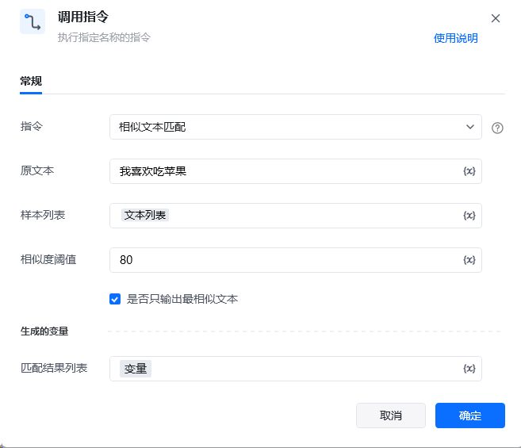
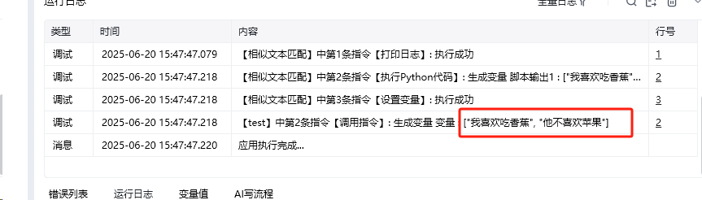

<strong>描述</strong>

该 RPA 自定义指令用于对输入的原文本，与样本列表中的文本进行相似度匹配，支持设置相似度阈值筛选结果，可按需选择仅输出最相似文本，实现文本内容的自动化相似性检索，适用于数据清洗、内容查重等场景。

<strong>使用示例</strong>

<strong>运行效果</strong>

<Info>
  使用指令过程中遇到问题？前往 [八爪鱼RPA 开发者社区问答板块](https://rpa.bazhuayu.com/community/questions) 提问，获取官方与社区帮助。
</Info>
