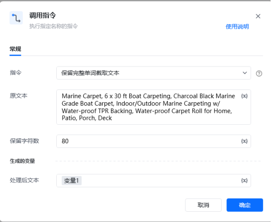
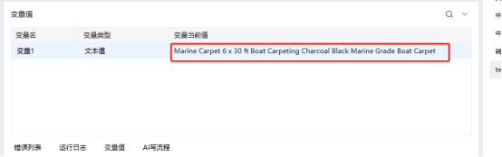

<strong>描述</strong>

按长度保留字符串内的文本，会将最后一个单词完整保留

例子：

原文本

Marine Carpet, 6 x 30 ft Boat Carpeting, Charcoal Black Marine Grade Boat Carpet, Indoor/Outdoor Marine Carpeting w/ Water-proof TPR Backing, Water-proof Carpet Roll for Home, Patio, Porch, Deck

原文本长度： 196

处理后文本

Marine Carpet 6 x 30 ft Boat Carpeting Charcoal Black Marine Grade Boat Carpet

处理后文本长度： 78

<strong>使用示例</strong>

<strong>运行效果</strong>

<Info>
  使用指令过程中遇到问题？前往 [八爪鱼RPA 开发者社区问答板块](https://rpa.bazhuayu.com/community/questions) 提问，获取官方与社区帮助。
</Info>
