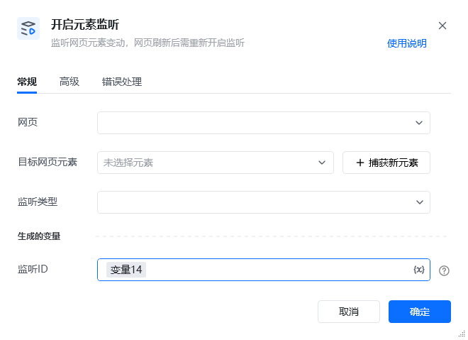
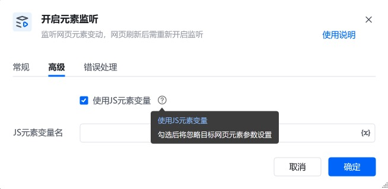

## 1. 功能说明

该 RPA 指令用于监听网页中指定元素的动态变动，包括元素的新增、删除、属性变化等事件。当目标元素发生变动时，会触发后续流程执行。

它是处理动态渲染网页的核心指令，需注意：网页刷新后需重新开启监听以恢复功能。
## 2. 配置参数

参数名必填说明<strong>网页</strong>是选择需要监听元素变动的目标网页对象，需为当前流程中已打开的网页。<strong>目标网页元素</strong>是通过「捕获新元素」按钮定位需要监听的元素节点，或选择已保存的元素变量。<strong>监听类型</strong>是选择监听的事件类型，如「监听子元素增加」「监听文本内容变化」「监听元素属性变化」等。<strong>监听 ID</strong>是定义一个变量名作为监听实例的唯一标识，后续可通过该 ID 关联或终止监听。<strong>使用 JS 元素变量 </strong>	否勾选后将忽略「目标网页元素」参数，直接通过 JS 变量定位目标元素，适合复杂动态场景。<strong>JS 元素变量名</strong>否当「使用 JS 元素变量」勾选时，需填写已定义的 JS 元素变量名，用于定位监听目标。

## 3. 使用示例
场景：监听电商商品列表的新增元素 在「网页」下拉框选择目标商品列表页面。 点击「捕获新元素」，框选商品列表的父容器元素，自动填充「目标网页元素」。 「监听类型」选择「监听子元素增加」。 「监听 ID」输入变量名 弹幕元素监听ID执行效果：当弹幕框中有新的弹幕元素时，监听实例会实时捕获动态数据。

<Info>
  使用指令过程中遇到问题？前往 [八爪鱼RPA 开发者社区问答板块](https://rpa.bazhuayu.com/community/questions) 提问，获取官方与社区帮助。
</Info>
