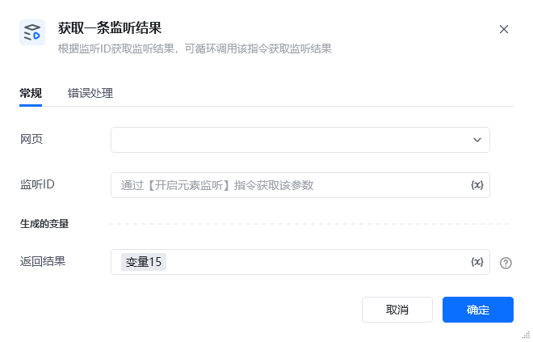

## 1. 功能说明

该 RPA 指令用于从已开启的元素监听实例中，获取一条最新的元素变动监听结果，并将其保存到指定变量中。它是承接「开启元素监听」的核心指令，支持循环调用以批量获取所有变动数据。
## 2. 配置参数

参数名必填说明<strong>网页</strong>是选择已开启元素监听的目标网页对象，需与「开启元素监听」指令中选择的网页保持一致。<strong>监听 ID</strong>是填写「开启元素监听」时定义的监听实例唯一标识，用于关联对应的监听资源。<strong>返回结果</strong>是定义一个变量名，用于存储获取到的单条监听结果（字典格式，包含元素变动的详细信息）。

<strong>返回结果说明</strong>

该指令返回的结果为字典格式，包含元素变动的完整信息，示例如下：\{
"data": "tab-item_3XSsF ",
"oldData": "tab-item_3XSsF tab-item-active_2PcDN",
"type": "attributes",
"attributeName": "class",
"time": "2025-11-20 15:05:05"
\}

字段说明：data：元素变动后的最新数据（如修改后的属性值、新文本内容等）oldData：元素变动前的原始数据，用于对比变化内容type：变动类型，可选值为child（子元素新增）、text（文本内容变动）、attributes（属性变动）attributeName：当type为attributes时，显示具体变动的属性名称（如class、src）time：监听事件触发的时间戳，精确到秒
## 3. 使用示例

场景：获取弹幕元素新增的监听结果<strong>前置条件</strong>：已通过「开启元素监听」指令创建了监听 ID 为 弹幕监听ID 的实例。<strong>配置步骤</strong>在「网页」下拉框选择对应的弹幕页面。 「监听 ID」输入变量  弹幕监听ID「返回结果」输入变量名 监听结果<strong>执行效果</strong>

指令会从 弹幕监听ID 实例中获取一条最新的监听结果，并存入 监听结果 变量。若配合「循环」指令反复调用该指令，可批量获取所有元素变动数据，实现动态数据的完整采集。
4. 注意事项该指令仅能获取一条监听结果，若需批量采集所有变动数据，需配合「循环」指令持续调用，直到返回空。需确保「监听 ID」与「开启元素监听」指令中的配置完全一致，否则无法关联到正确的监听实例。

<Info>
  使用指令过程中遇到问题？前往 [八爪鱼RPA 开发者社区问答板块](https://rpa.bazhuayu.com/community/questions) 提问，获取官方与社区帮助。
</Info>
