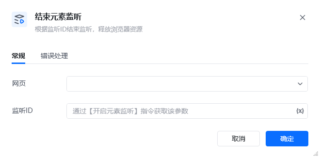

## 1. 功能说明

该 RPA 指令用于终止已开启的元素监听实例，释放其占用的浏览器资源，是元素监听流程的收尾指令，可避免长期监听导致的内存泄漏或浏览器性能下降。
## 2. 配置参数

参数名必填说明<strong>网页</strong>是选择已开启元素监听的目标网页对象，需与「开启元素监听」指令中选择的网页保持一致。<strong>监听 ID</strong>是填写「开启元素监听」时定义的监听实例唯一标识，用于精准终止对应的监听进程。

## 3. 使用示例
### 场景：完成弹幕动态采集后终止监听

<strong>前置条件</strong>：已通过「开启元素监听」指令创建了监听 ID 为 弹幕监听ID 的实例，且已完成动态弹幕数据采集。<strong>配置步骤</strong>在「网页」下拉框选择对应的弹幕页面。「监听 ID」输入变量 弹幕监听ID

3. <strong>执行效果</strong>

指令会终止 弹幕监听ID对应的监听进程，释放浏览器中用于监听的 JS 资源与内存，避免后续流程出现资源占用问题。
4. 注意事项建议在元素监听流程结束后立即调用该指令，不要长期保留闲置的监听实例。若需重新开启监听，需再次执行「开启元素监听」指令并重新配置参数。若同一网页存在多个监听实例，需通过不同的监听ID分别终止，避免误关其他实例。网页刷新后监听实例会自动失效，但仍建议主动调用该指令以确保资源完全释放。

<Info>
  使用指令过程中遇到问题？前往 [八爪鱼RPA 开发者社区问答板块](https://rpa.bazhuayu.com/community/questions) 提问，获取官方与社区帮助。
</Info>
