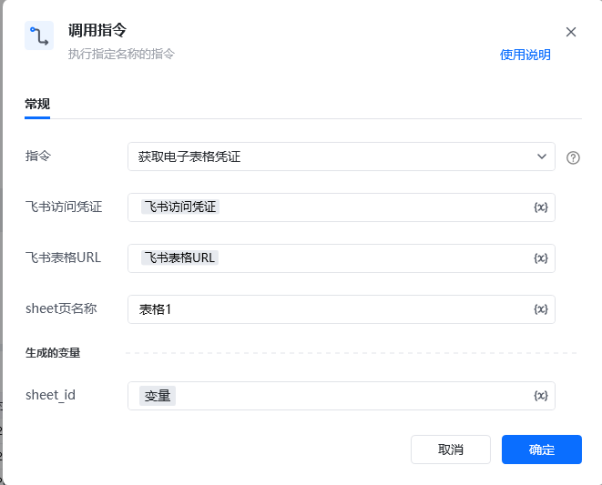
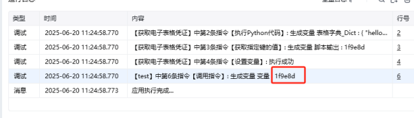

## <strong>一、指令概述 </strong>

该 RPA 自定义指令用于从飞书表格中获取指定工作表的凭证信息（sheet_id ），作为后续操作（如单元格填充图片、数据读写等）的前置依赖，实现飞书表格自动化流程中凭证信息的提取与传递。
## <strong>二、调用参数配置示意 </strong>

在 RPA 流程设计中，通过 “调用指令” 配置参数执行获取操作，配置界面如下：

参数名称配置示例说明指令获取电子表格凭证选择需执行的自定义指令名称飞书访问凭证飞书访问凭证（变量）使用《获取飞书访问凭证》指令获取飞书表格 URL飞书表格 URL（变量）网页端飞书表格的 Web 链接，指定目标表格位置sheet 页名称表格 1需获取凭证对应的工作表名称生成的变量 - sheet_id变量存储指令执行结果（sheet_id ）的变量，供后续流程调用
## <strong>三、使用示例 </strong>
### <strong>（一）参数配置 </strong>

• 飞书访问凭证：{飞书访问凭证变量}（权限验证凭证 ）

• 飞书表格 URL：{飞书表格URL变量}（目标表格 Web 地址 ）

• Sheet 页名称：表格1

• 生成的变量 - sheet_id：变量（存储提取的工作表凭证 ）
### <strong>（二）执行流程 </strong>

调用指令后，RPA 工具通过飞书接口，利用输入的访问凭证、表格 URL 和工作表名称，提取对应工作表的 sheet_id ，并存储到指定变量中，为后续飞书表格操作提供凭证支持。
## <strong>四、运行效果 </strong>

执行成功后，可在运行日志中查看生成的 sheet_id 变量值，示例日志如下：

日志内容显示指令执行成功，生成变量 sheet_id 的值（如 1f9e8d ），可用于后续流程调用，验证凭证提取功能正常。
## <strong>五、注意事项 </strong>

1. <strong>权限要求</strong>：飞书访问凭证需具备访问目标表格及工作表的权限，否则无法提取 sheet_id 。

2. <strong>参数准确性</strong>：飞书表格 URL 需正确指向目标表格，sheet 页名称需与实际工作表名称完全一致（区分大小写、空格等 ）。

3. <strong>异常排查</strong>：若运行日志无 sheet_id 生成或报错，检查网络连接、凭证有效性、参数配置是否正确。
## <strong>六、延伸应用 </strong>

该指令作为飞书表格自动化流程的基础环节，可与其他指令联动：

• <strong>单元格操作流程</strong>：结合 “单元格填充图片”“数据写入” 等指令，通过提取的 sheet_id 精准操作指定工作表。

• <strong>多工作表处理</strong>：批量循环调用该指令，获取多个工作表的 sheet_id ，实现多表自动化处理（如报表汇总、数据同步 ）。

<Info>
  使用指令过程中遇到问题？前往 [八爪鱼RPA 开发者社区问答板块](https://rpa.bazhuayu.com/community/questions) 提问，获取官方与社区帮助。
</Info>
