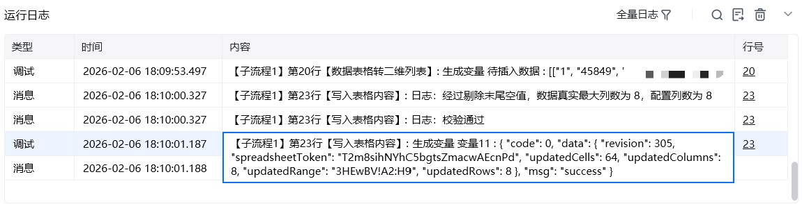
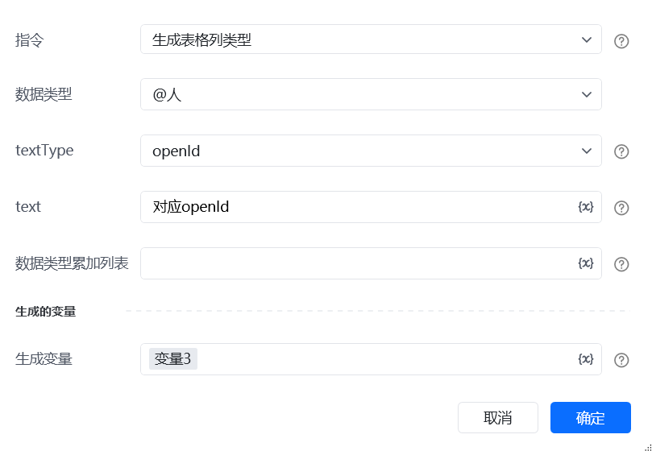

## <strong>一、指令概述</strong>

该 RPA 指令用于向<strong>飞书表格的指定区域写入数据</strong>，同时返回包含操作结果（如更新范围、行数等）的 JSON 信息，便于后续流程校验写入是否成功，支撑飞书表格的自动化数据录入与结果反馈场景。

- 飞书官方开发文档参考： https://open.feishu.cn/document/server-docs/docs/sheets-v3/data-operation/write-data-to-a-single-range[https://open.feishu.cn/document/server-docs/docs/sheets-v3/data-operation/write-data-to-a-single-range](https://open.feishu.cn/document/server-docs/docs/sheets-v3/data-operation/write-data-to-a-single-range) 默认模式：无需配置写入内容列类型，全部内容将作为纯文本写入。进阶模式：配合「生成表格列类型」指令，支持写入超链接、@人员、@文档、公式等复杂飞书对象。
## 二、调用参数配置参数名称配置说明约束规则飞书访问凭证飞书开放平台的访问凭证，用于接口身份认证必填；可通过「获取飞书访问凭证」指令获取，需确保凭证在有效期内飞书表格 Url目标飞书在线表格的访问链接必填；可通过「获取 sheet 页的 url」指令获取，需确保表格已共享且凭证具备编辑权限Sheet 页名称目标表格内的 Sheet 页名称必填；需与表格内 Sheet 页名称完全一致（区分大小写）区域数据写入的表格区域（如A1:B4）必填；格式为 “起始单元格：结束单元格”，需覆盖写入内容的二维列表维度写入内容（二维列表）待写入的批量数据，格式为二维数组（如[["张三", 100], ["李四", 200]]）必填；列表的行列数需与「区域」的行列范围匹配写入内容列类型列类型配置列表，用于定义复杂列类型（如 @人、@文档）选填；可通过「生成表格列类型」指令获取，无复杂类型时留空，当不为空时这里的列类型、写入内容对应的列类型和写入表格的列类型三者要保持一致
## <strong>三、返回结果说明</strong>

指令执行后，会生成包含操作结果的 JSON 数据（关键敏感参数已掩码），示例：\{ "code": 0, "data": \{ "revision": 83, "spreadsheetToken": "********************", // 飞书表格唯一标识（已掩码） "updatedCells": 7, "updatedColumns": 3, "updatedRange": "1XYmgo!A1:C3", "updatedRows": 3 \}, "msg": "success" \}

各字段含义：

• code：状态码，0 代表执行成功（非 0 通常为失败，需结合 msg 排查）。

• data：详细操作结果：

◦ revision：表格版本号（每次修改递增，可用于版本追踪）。

◦ spreadsheetToken：飞书表格唯一标识（敏感信息，实际为加密字符串）。

◦ updatedCells：本次写入更新的单元格总数。

◦ updatedColumns：本次写入涉及的列数。

◦ updatedRange：实际写入的单元格范围（格式为 “Sheet 页标识！起始单元格：结束单元格”）。

◦ updatedRows：本次写入涉及的行数。

• msg：提示信息，success 表示操作成功。
## <strong>四、使用示例（员工信息表写入 + 结果校验）</strong>
### <strong>场景：</strong>进阶模式：配合「生成表格列类型」指令，支持写入超链接、@人员、@文档、公式等复杂飞书对象。

通过读取飞书电子表格别的sheet页的数据写进去另一张飞书电子表格的sheet页

第一步：读取表格数据

第二步：调用生成表格列类型生成对应字段的列类型如下图：这个案例里面包括文本、数字、公式、链接，调用生成表格列类型结果如下图所示：为后面写入表格内容做准备，写入表格内容数据会根据这个类型和你提供的二维列表内容，一个一个去匹配生成对应字段飞书电子表格认识的数据

第三步：先把读到的数据转成二维列表，要求：二维列表的数据要跟生成表格列类型和新插入的表格数据类型一致

调用写入表格内容，实现飞书电子表格数据的写入

输出结果：

第二种当要插入的类型有@人的时候，可以先读取表格中相同@人的数据然后读取出来

接着调用生成表格列类型生成@人数据类型如下图：

输出结果：

第二步调用写入表格内容插入数据，这样就可以实现步骤跟上面的第一个案例是一样的

<strong>案例二：</strong>写入表格内容中：写入内容列类型为空时，默认写入表格内容所有字段都为空例子如下：

## <strong>五、注意事项</strong>

1. <strong>权限与有效性</strong>：“飞书访问凭证” 需有目标表格<strong>编辑权限</strong>且有效；“飞书表格 Url” 和 “Sheet 页名称” 需对应真实存在的表格 / Sheet，否则指令报错。

2. <strong>区域与数据匹配</strong>：“区域” 的行列范围需与 “写入内容” 的二维列表<strong>行数、列数完全匹配</strong>（如区域 A1:C3 对应 3 行 3 列，二维列表也需 3 行 3 列），否则可能数据错位或返回异常结果。

3. <strong>结果校验必要性</strong>：实际流程需校验返回结果的 code 和 msg，确保写入成功；若失败，可根据 msg 排查（如权限不足、数据格式错误等）。

<strong>当选择数据类型有日期、数值、下拉列表时需要先到表格中把你想要插入日期、数值、下拉列表的区域设置成对应的形式</strong>

<strong>读取表格公式数据时如果读取出来数据是没有=不需要补充，后面插入的时候内部代码会自动添加。</strong>
## <strong>六、延伸应用</strong>

<Info>
  使用指令过程中遇到问题？前往 [八爪鱼RPA 开发者社区问答板块](https://rpa.bazhuayu.com/community/questions) 提问，获取官方与社区帮助。
</Info>
