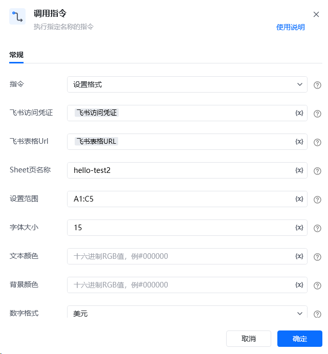
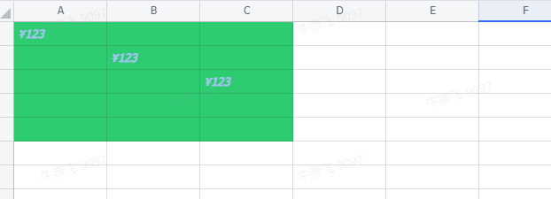

## <strong>一、指令概述 </strong>

该 RPA 自定义指令用于通过飞书接口，对飞书表格指定工作表、指定范围的单元格，批量设置字体大小、文本颜色、背景颜色、是否加粗 / 倾斜以及数字格式等样式，实现表格内容可视化的自动化美化，提升表格排版效率。

飞书官方开发文档参考： https://open.feishu.cn/document/server-docs/docs/sheets-v3/data-operation/set-cell-style[https://open.feishu.cn/document/server-docs/docs/sheets-v3/data-operation/set-cell-style](https://open.feishu.cn/document/server-docs/docs/sheets-v3/data-operation/set-cell-style)
## <strong>二、调用参数配置示意 </strong>

在 RPA 流程设计中，通过 “调用指令” 配置参数执行格式设置操作，配置界面如下：

参数名称配置示例说明指令设置格式选择需执行的自定义指令名称飞书访问凭证飞书访问凭证（变量）用于验证飞书接口访问权限的凭证，需具备表格编辑权限飞书表格 URL飞书表格 URL（变量）网页端飞书表格的 Web 链接，指定目标表格位置Sheet 页名称表格 1需设置格式的工作表名称，需与表格中实际 sheet 页名称一致字体大小数值10设置单元格内容的字体大小文本颜色#A5C3F7文本颜色的十六进制色值，控制文字显示颜色。可通过 https://colorpicker.me/ 查询 RGB 转十六进制值背景颜色#2ECC71背景颜色的十六进制色值，控制单元格底色。可通过 https://colorpicker.me/ 查询 RGB 转十六进制值是否加粗勾选开启后，单元格内容以加粗样式显示数字格式人民币选择单元格内容的数字显示格式（如人民币、美元、日期等 ）是否斜体勾选开启后，单元格内容以斜体样式显示设置范围A1:C5需设置格式的单元格范围，按 Excel 坐标规则填写（如 A1:C5 表示 A 列 1 行至 C 列 5 行 ）生成的变量 - 返回结果变量 1存储指令执行结果的变量，可用于后续流程判断执行状态
## 三、<strong>使用示例 </strong>
### <strong>（一）参数配置 </strong>

• 飞书访问凭证：{飞书访问凭证变量}（具备编辑权限的验证凭证 ）

• 飞书表格 URL：{飞书表格URL变量}（目标表格 Web 地址 ）

• sheet 页名称：表格1（需设置格式的工作表名称 ）

• 字体大小：10（字体大小 10 磅 ）

• 文本颜色：#A5C3F7（浅蓝紫色文字 ）

• 背景颜色：#2ECC71（绿色背景 ）

• 是否加粗：勾选（文字加粗 ）

• 数字格式：人民币（内容按人民币格式显示，如 ¥123 ）

• 是否斜体：勾选（文字倾斜 ）

• 设置范围：A1:C5（A1 到 C5 单元格区域 ）

• 生成的变量 - 返回结果：变量1（存储执行结果 ）
### <strong>（二）执行流程 </strong>

调用指令后，RPA 工具通过飞书接口，利用访问凭证、表格 URL 定位目标表格及工作表，依据设置范围选中对应单元格区域，再按配置的字体、颜色、样式、数字格式等参数，批量应用格式设置。
## <strong>四、运行效果 </strong>

执行成功后，飞书表格中指定工作表（表格 1 ）、指定范围（A1:C5 ）的单元格，会按配置呈现样式：绿色背景（#2ECC71 ）、浅蓝紫色文字（#A5C3F7 ）、加粗且倾斜、数字以人民币格式（如 ¥123 ）显示，效果如下

## <strong>五、注意事项 </strong>

1. <strong>权限要求</strong>：飞书访问凭证需具备目标表格的编辑权限，否则无法修改单元格格式。

2. <strong>参数规范</strong>：

◦ 颜色值需为正确的十六进制色值（如#A5C3F7 ），否则可能显示异常；

◦ 设置范围需符合 Excel 坐标规则（如A1:C5 ），避免范围无效；

◦ 数字格式需与单元格实际内容适配（如设置 “人民币” 格式，单元格建议填入数值型内容 ）。

3. <strong>异常排查</strong>：若格式未按预期应用，检查网络连接、凭证权限、参数配置（尤其是颜色值、设置范围 ）是否正确，或单元格原有格式是否冲突。
## <strong>六、延伸应用 </strong>

该指令可结合数据处理流程，拓展自动化场景：

• <strong>报表标准化排版</strong>：搭配数据写入指令，在数据填充后自动应用统一格式，快速生成规范可视化报表。

• <strong>动态格式调整</strong>：结合条件判断指令，根据单元格内容（如数值大小、文本关键词 ），动态切换格式配置（如不同颜色标识数据等级 ），实现智能美化。

<Info>
  使用指令过程中遇到问题？前往 [八爪鱼RPA 开发者社区问答板块](https://rpa.bazhuayu.com/community/questions) 提问，获取官方与社区帮助。
</Info>
