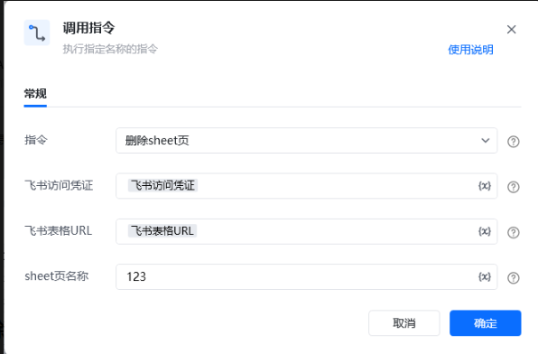
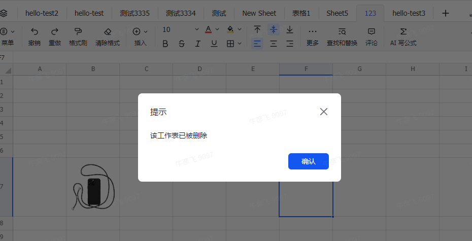

# <strong>“删除 sheet 页” RPA 自定义指令说明 </strong>
## <strong>一、指令概述 </strong>

该 RPA 自定义指令用于通过飞书接口，删除飞书表格中指定名称的工作表（sheet 页），实现表格结构的自动化精简管理，支持流程化清理冗余 sheet 页场景。

飞书官方开发文档参考：https://open.feishu.cn/document/server-docs/docs/sheets-v3/spreadsheet-sheet/operate-sheets[飞书官方开发文档参考：https://open.feishu.cn/document/server-docs/docs/sheets-v3/spreadsheet-sheet/operate-sheets](https://open.feishu.cn/document/server-docs/docs/sheets-v3/spreadsheet-sheet/operate-sheets)
## <strong>二、调用参数配置示意 </strong>

在 RPA 流程设计中，通过 “调用指令” 配置参数执行删除操作，配置界面如下：

参数名称配置示例说明指令删除 sheet 页选择需执行的自定义指令名称飞书访问凭证飞书访问凭证（变量）用于验证飞书接口访问权限的凭证，需具备表格编辑权限飞书表格 URL飞书表格 URL（变量）网页端飞书表格的 Web 链接，指定目标表格位置sheet 页名称123需删除的工作表名称，需与表格中实际 sheet 页名称完全一致
## <strong>三、使用示例 </strong>
### <strong>（一）参数配置 </strong>

• 飞书访问凭证：\{飞书访问凭证变量\}（具备编辑权限的验证凭证 ）

• 飞书表格 URL：\{飞书表格 URL 变量\}（目标表格 Web 地址 ）

• sheet 页名称：123（需删除的工作表名称 ）
### <strong>（二）执行流程 </strong>

调用指令后，RPA 工具通过飞书接口，利用访问凭证、表格 URL 定位目标表格，依据 sheet 页名称找到对应工作表并执行删除操作。
## <strong>四、运行效果 </strong>

执行成功后，飞书表格中指定 sheet 页（如名称为 123 的 sheet 页）被删除，再次访问表格时，会弹出提示 “该工作表已被删除”

## <strong>五、注意事项 </strong>

1. <strong>权限要求</strong>：飞书访问凭证需具备目标表格的编辑权限，否则无法执行删除操作。

2. <strong>名称准确性</strong>：sheet 页名称需与表格中实际名称完全一致（区分大小写、空格等 ），避免因名称错误导致删除失败。

3. <strong>数据风险</strong>：删除 sheet 页为不可逆操作，执行前需确认该 sheet 页无重要数据，或已完成数据备份。

4. <strong>异常排查</strong>：若未弹出删除提示或删除失败，检查网络连接、凭证权限、sheet 页名称配置是否正确。
## <strong>六、延伸应用 </strong>

该指令可结合其他流程，拓展自动化场景：

• <strong>定期清理流程</strong>：搭配时间触发指令，定期删除表格中指定名称（如含 “临时” 关键词 ）的 sheet 页，自动维护表格整洁。

• <strong>多表批量删除</strong>：结合 “获取 sheet 页名称” 指令，遍历名称列表，批量删除符合条件的 sheet 页，高效处理多表格结构优化。

<Info>
  使用指令过程中遇到问题？前往 [八爪鱼RPA 开发者社区问答板块](https://rpa.bazhuayu.com/community/questions) 提问，获取官方与社区帮助。
</Info>
