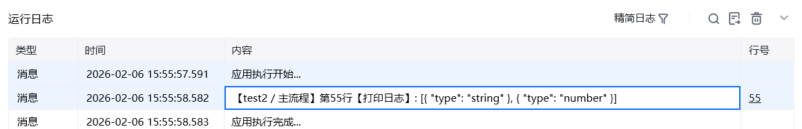
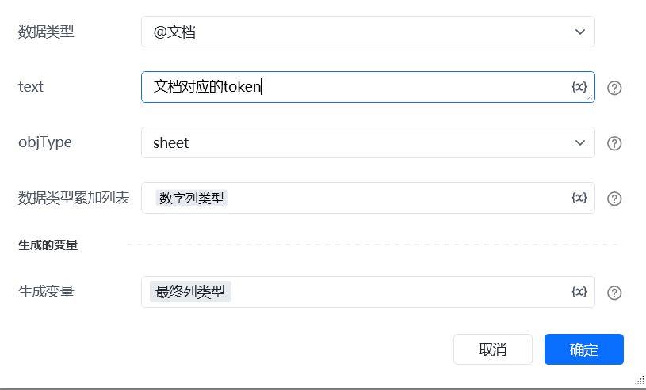
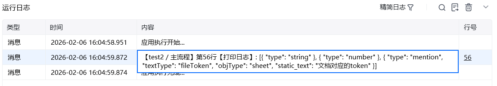

## 一、指令概述

用于构建飞书表格写入时的<strong>列类型配置项</strong>，支持文本、数字、日期、@人、@文档、公式等全量飞书表格列类型。可生成<strong>单一列类型配置</strong>，也可通过「数据类型累加列表」实现<strong>多列类型配置的叠加拼接</strong>，最终输出标准的列类型配置列表，作为下游「写入内容」等指令的入参，解决飞书复杂列类型（如 @人、@文档）写入格式错误的问题。

参考文档： 支持写入数据类型[支持写入数据类型](https://open.feishu.cn/document/server-docs/docs/sheets-v3/data-types-supported-by-sheets)
## 二、调用参数配置参数名称配置说明约束规则数据类型选择目标列的基础数据类型，可选值：文本、数字、日期、链接、邮箱、@人、公式、下拉列表、@文档必填；不同数据类型对应不同的子参数显隐逻辑textType仅当「数据类型 = @人」时显示，可选值：email、openId、unionId选填；用于指定 @人时的用户标识类型，非 @人类型无需配置text仅当「数据类型 = @人 / @文档 / 公式」时显示；@人：填写 textType 对应的用户标识（如 openId）；@文档：填写文档 token；公式：填写飞书表格公式内容选填；根据所选数据类型填写对应值，非目标类型无需配置objType仅当「数据类型 = @文档」时显示，可选值：sheet、docx、slides、bitable、mindnote选填；用于指定 @文档的文件类型，非 @文档类型无需配置数据类型原列表用于多列类型配置的叠加，填写上一次「生成表格列类型」指令输出的变量选填；首次生成单列表配置时留空，二次及以上累加多列配置时必填，需与前一次输出变量格式一致数据类型列表存储指令输出的列类型配置结果的变量名称必填；用于承接最终的列类型配置列
三、输出说明<strong>输出类型定义</strong>：输出为<strong>任意值列表（数组类型）</strong>，为对应一列或者多列的类型配置；如下图所示：

## 四、典型操作示例：
### 生成多列类型配置（文本 + @文档 + 数字，累加用法）
#### 场景：

写入 3 列数据，分别为「文本」、「@文档」、「数字」，需拼接多列类型配置。

<strong>第一步：生成文本列配置</strong>

<strong>第二步：生成数字列配置（累加前两列配置）</strong>

<strong>第三步：生成 @文档列配置（累加文本配置）</strong>

<strong>最终结果</strong>：生成变量存储 3 列配置列表，可供后续飞书电子表格的「写入内容」调用，飞书电子表格中写入内容列类型参数可通过这个指令调用

<strong>注意点：</strong>

<Info>
  使用指令过程中遇到问题？前往 [八爪鱼RPA 开发者社区问答板块](https://rpa.bazhuayu.com/community/questions) 提问，获取官方与社区帮助。
</Info>
