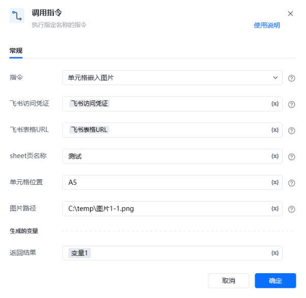

## <strong>一、指令概述 </strong>

该 RPA 自定义指令用于通过接口在飞书表格的指定单元格中嵌入图片，实现自动化图片插入操作，提升表格数据处理效率。

飞书官方开发文档参考： https://open.feishu.cn/document/server-docs/docs/sheets-v3/data-operation/write-images[https://open.feishu.cn/document/server-docs/docs/sheets-v3/data-operation/write-images](https://open.feishu.cn/document/server-docs/docs/sheets-v3/data-operation/write-images)
## <strong>二、调用参数配置示意 </strong>

在 RPA 流程设计中，通过 “调用指令” 配置相关参数，执行嵌入图片操作，配置界面如下：

参数名称配置示例说明指令单元格嵌入图片选择需执行的自定义指令名称飞书访问凭证飞书访问凭证（变量）通过《获取飞书访问凭证》指令生成，用于验证接口访问权限飞书表格 URL飞书表格 URL（变量）网页端飞书表格的 Web 链接，指定目标表格位置sheet 页名称测试需插入图片的工作表名称单元格位置A5插入图片的单元格坐标图片路径C:\temp\ 图片 1-1.png待嵌入图片的本地文件地址返回结果变量 1存储指令执行结果的变量
## <strong>三、使用示例 </strong>
### <strong>（一）参数配置 </strong>

• 飞书访问凭证：\{飞书访问凭证变量\}（由获取凭证指令生成）

• 飞书表格 URL：\{飞书表格 URL 变量\}（目标表格 Web 链接）

• Sheet 页名称：测试

• 单元格位置：A5

• 图片路径：C:\temp\图片1-1.png
### <strong>（二）执行流程 </strong>

调用指令后，RPA 工具通过飞书接口读取指定图片文件，自动插入到飞书表格 “测试” 工作表的 A5 单元格，完成嵌入操作。
## <strong>四、运行效果 </strong>

执行成功后，飞书表格对应单元格将显示嵌入的图片，实际效果如下：

（注：图中 A5 单元格已成功嵌入目标图片，直观呈现指令执行结果 ）
## <strong>五、注意事项 </strong>

1. <strong>权限要求</strong>：飞书访问凭证需具备表格编辑权限，否则插入操作会失败。

2. <strong>路径规范</strong>：图片路径需为本地有效路径，且文件格式需支持飞书表格（如 PNG、JPG 等）。

3. <strong>坐标格式</strong>：单元格位置需用 Excel 标准坐标（如 A1、B3 ），避免格式错误导致插入位置异常。

4. <strong>异常排查</strong>：若插入失败，可检查网络连接、凭证有效性、图片路径及单元格坐标是否正确。
## <strong>六、延伸应用 </strong>

该指令可与其他 RPA 指令组合，实现批量场景：

• <strong>批量报表生成</strong>：自动嵌入多张图表、截图至表格对应位置，高效生成可视化报表。

• <strong>数据流程联动</strong>：结合数据采集、处理指令，在数据更新后自动补充图片，完善表格信息。

（说明：文中截图链接为示例，实际使用时需替换为真实可访问的图片存储链接，如企业内部图床、云存储分享链接等 。若使用本地截图插入文档，需按文档格式要求调整插入方式 。 ）

<Info>
  使用指令过程中遇到问题？前往 [八爪鱼RPA 开发者社区问答板块](https://rpa.bazhuayu.com/community/questions) 提问，获取官方与社区帮助。
</Info>
