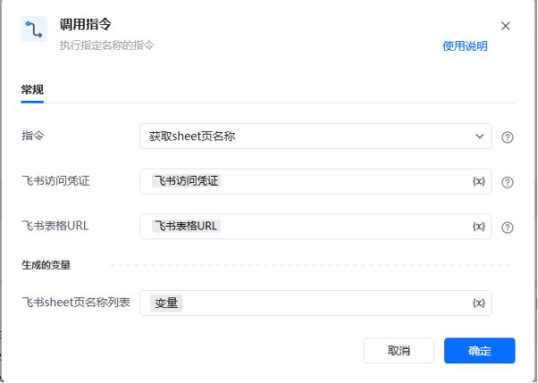
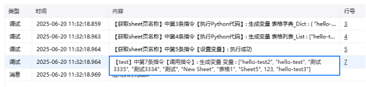

## <strong>一、指令概述 </strong>

该 RPA 自定义指令用于通过飞书接口，从指定飞书表格中获取所有工作表（sheet 页）的名称信息，生成名称列表，为后续表格操作（如定位特定 sheet 页、批量处理多 sheet 页 ）提供基础数据支持。

飞书官方开发文档参考：https://open.feishu.cn/document/server-docs/docs/sheets-v3/spreadsheet-sheet/query
## <strong>二、调用参数配置示意 </strong>

在 RPA 流程设计中，通过 “调用指令” 配置参数执行获取操作，配置界面如下：

参数名称配置示例说明指令获取 sheet 页名称选择需执行的自定义指令名称飞书访问凭证飞书访问凭证（变量）用于验证飞书接口访问权限的凭证，通常由登录或权限获取流程生成飞书表格 URL飞书表格 URL（变量）网页端飞书表格的 Web 链接，指定目标表格位置生成的变量 - 飞书 sheet 页名称列表变量存储指令执行结果（sheet 页名称列表 ）的变量，供后续流程调用
## <strong>三、使用示例 </strong>
### <strong>（一）参数配置 </strong>

• 飞书访问凭证：\{飞书访问凭证变量\}（权限验证凭证 ）

• 飞书表格 URL：\{飞书表格 URL 变量\}（目标表格 Web 地址 ）

• 生成的变量 - 飞书 sheet 页名称列表：变量（存储提取的 sheet 页名称集合 ）
### <strong>（二）执行流程 </strong>

调用指令后，RPA 工具通过飞书接口，利用输入的访问凭证和表格 URL，获取目标表格中所有工作表的名称，整理为列表格式并存储到指定变量中，支持后续流程调用。
## <strong>四、运行效果 </strong>

执行成功后，可在运行日志中查看生成的 sheet 页名称列表，示例日志如下：

## <strong>五、注意事项 </strong>

1. <strong>权限要求</strong>：飞书访问凭证需具备访问目标表格的权限，否则无法获取 sheet 页名称。

2. <strong>参数准确性</strong>：飞书表格 URL 需正确指向目标表格，确保接口能定位到有效表格资源。

3. <strong>异常排查</strong>：若运行日志无名称列表生成或报错，检查网络连接、凭证有效性、表格 URL 配置是否正确。
## <strong>六、延伸应用 </strong>

该指令可作为飞书表格多 sheet 页自动化处理的基础，拓展应用场景：

• <strong>sheet 页筛选操作</strong>：结合条件判断指令，从名称列表中筛选出目标 sheet 页（如含特定关键词的 sheet ），执行针对性操作。

• <strong>批量处理流程</strong>：循环遍历名称列表，对每个 sheet 页执行数据读写、格式调整等操作，实现多 sheet 页自动化处理。

<Info>
  使用指令过程中遇到问题？前往 [八爪鱼RPA 开发者社区问答板块](https://rpa.bazhuayu.com/community/questions) 提问，获取官方与社区帮助。
</Info>
