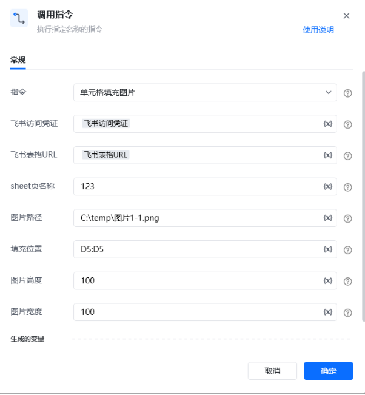
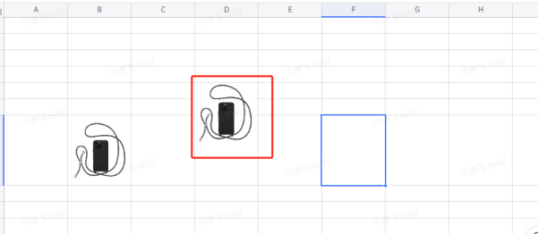

## <strong>一、指令概述 </strong>

该 RPA 自定义指令用于借助接口，在飞书表格指定单元格位置填充图片，支持自定义图片尺寸，实现自动化图片插入，提升表格内容丰富度与数据呈现效率。

飞书官方开发文档参考： https://open.feishu.cn/document/server-docs/docs/sheets-v3/spreadsheet-sheet-float_image/create[https://open.feishu.cn/document/server-docs/docs/sheets-v3/spreadsheet-sheet-float_image/create](https://open.feishu.cn/document/server-docs/docs/sheets-v3/spreadsheet-sheet-float_image/create)
## <strong>二、调用参数配置示意 </strong>

在 RPA 流程设计里，通过 “调用指令” 配置参数执行填充操作，配置界面如下：

参数名称配置示例说明指令单元格填充图片选择需执行的自定义指令名称飞书访问凭证飞书访问凭证（变量）通过《获取飞书访问凭证》指令生成，用于验证接口访问权限飞书表格 URL飞书表格 URL（变量）网页端飞书表格的 Web 链接，指定目标表格位置sheet 页名称123需填充图片的工作表名称图片路径C:\temp\ 图片 1-1.png待填充图片的本地文件地址填充位置D5插入图片的单元格起始位置图片高度100自定义填充后图片的高度（像素单位 ）图片宽度100自定义填充后图片的宽度（像素单位 ）生成的变量 - 返回结果（按需配置变量存储结果）存储指令执行结果的变量，可用于后续流程判断
## <strong>三、使用示例 </strong>
### <strong>（一）参数配置 </strong>

• 飞书访问凭证：\{飞书访问凭证变量\}（由获取凭证指令生成）

• 飞书表格 URL：\{飞书表格 URL 变量\}（目标表格 Web 链接）

• Sheet 页名称：123

• 图片路径：C:\temp\图片1-1.png

• 填充位置：D5:D5

• 图片高度：100

• 图片宽度：100
### <strong>（二）执行流程 </strong>

调用指令后，RPA 工具通过飞书接口读取指定图片文件，按设定的尺寸（高 100px、宽 100px ），自动填充到飞书表格 “123” 工作表的 D5 单元格，完成图片嵌入。
## <strong>四、运行效果 </strong>

执行成功后，飞书表格对应单元格按设定尺寸显示填充的图片，实际效果如下：

（注：图中 D5 单元格已按 100×100 像素尺寸成功填充目标图片，直观呈现指令执行结果 ）
## <strong>五、注意事项 </strong>

1. <strong>权限要求</strong>：飞书访问凭证需具备表格编辑权限，否则填充操作会失败。

2. <strong>路径规范</strong>：图片路径需为本地有效路径，且文件格式需支持飞书表格（如 PNG、JPG 等）。

3. <strong>坐标与尺寸</strong>：填充位置需用 Excel 标准坐标（如 A1、D5 ）；图片高度、宽度需为合理数值（非负整数 ），避免显示异常。

4. <strong>异常排查</strong>：若填充失败，可检查网络连接、凭证有效性、图片路径、单元格坐标及尺寸参数是否正确。
## <strong>六、延伸应用 </strong>

该指令可与其他 RPA 指令组合，拓展应用场景：

• <strong>标准化报表排版</strong>：批量填充多张图片并统一尺寸，快速完成可视化报表制作，保证格式规范。

• <strong>动态数据配图</strong>：结合数据变更监测指令，数据更新时自动填充对应图片，实现表格内容动态联动。

（说明：文中截图链接为示例，实际使用时需替换为真实可访问的图片存储链接，如企业内部图床、云存储分享链接等 。若用本地截图插入文档，需按文档格式要求调整插入方式 。 ）

<Info>
  使用指令过程中遇到问题？前往 [八爪鱼RPA 开发者社区问答板块](https://rpa.bazhuayu.com/community/questions) 提问，获取官方与社区帮助。
</Info>
