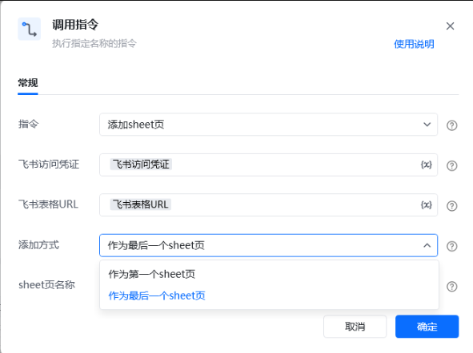
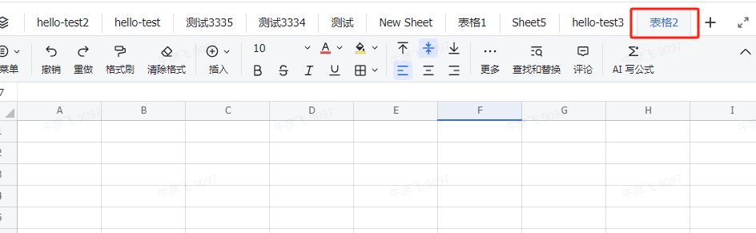

## <strong>一、指令概述 </strong>

该 RPA 自定义指令用于通过飞书接口，向指定飞书表格添加新工作表（sheet 页），支持设置添加位置（作为第一个或最后一个 sheet 页 ），实现表格结构的自动化扩展，满足批量创建工作表的场景需求。

飞书官方开发文档参考： https://open.feishu.cn/document/server-docs/docs/sheets-v3/spreadsheet-sheet/operate-sheets[https://open.feishu.cn/document/server-docs/docs/sheets-v3/spreadsheet-sheet/operate-sheets](https://open.feishu.cn/document/server-docs/docs/sheets-v3/spreadsheet-sheet/operate-sheets)
## <strong>二、调用参数配置示意 </strong>

在 RPA 流程设计中，通过 “调用指令” 配置参数执行添加操作，配置界面如下：

参数名称配置示例说明指令添加 sheet 页选择需执行的自定义指令名称飞书访问凭证飞书访问凭证（变量）用于验证飞书接口访问权限的凭证，需具备表格编辑权限飞书表格 URL飞书表格 URL（变量）网页端飞书表格的 Web 链接，指定目标表格位置添加方式作为最后一个 sheet 页选择新 sheet 页添加位置，支持 “作为第一个 sheet 页”“作为最后一个 sheet 页”sheet 页名称表格 2自定义新添加工作表的名称，需符合飞书表格命名规则
## <strong>三、使用示例 </strong>
### <strong>（一）参数配置 </strong>

• 飞书访问凭证：\{飞书访问凭证变量\}（具备编辑权限的验证凭证 ）

• 飞书表格 URL：\{飞书表格 URL 变量\}（目标表格 Web 地址 ）

• 添加方式：作为最后一个 sheet 页（新 sheet 页添加到表格末尾 ）

• sheet 页名称：表格 2（自定义新工作表名称 ）
### <strong>（二）执行流程 </strong>

调用指令后，RPA 工具通过飞书接口，利用访问凭证、表格 URL 定位目标表格，依据 “添加方式”（如作为最后一个 sheet 页 ）和 “sheet 页名称”（如表格 2 ），自动在目标表格中创建新工作表。
## <strong>四、运行效果 </strong>

执行成功后，飞书表格中会新增指定名称的工作表（如名称为 表格 2 的 sheet 页 ），添加位置与配置的 “添加方式” 一致（如作为最后一个 sheet 页时，出现在表格 sheet 页标签栏末尾 ），效果如下：

## <strong>五、注意事项 </strong>

1. <strong>权限要求</strong>：飞书访问凭证需具备目标表格的编辑权限，否则无法创建新 sheet 页。

2. <strong>名称规范</strong>：sheet 页名称需符合飞书表格命名规则（避免特殊字符、长度限制等 ），且不与现有 sheet 页名称重复，否则添加失败。

3. <strong>异常排查</strong>：若未新增 sheet 页或报错，检查网络连接、凭证权限、参数配置（尤其是名称唯一性、添加方式 ）是否正确。
## <strong>六、延伸应用 </strong>

该指令可结合其他流程，拓展自动化场景：

• <strong>模板化表格初始化</strong>：搭配 “设置格式”“数据写入” 等指令，自动添加新 sheet 页并初始化格式、填充模板数据，快速生成标准化表格。

• <strong>动态多表创建</strong>：结合业务数据（如按部门、日期 ），循环调用该指令，批量创建对应名称的 sheet 页，实现表格结构与业务需求联动。

<Info>
  使用指令过程中遇到问题？前往 [八爪鱼RPA 开发者社区问答板块](https://rpa.bazhuayu.com/community/questions) 提问，获取官方与社区帮助。
</Info>
