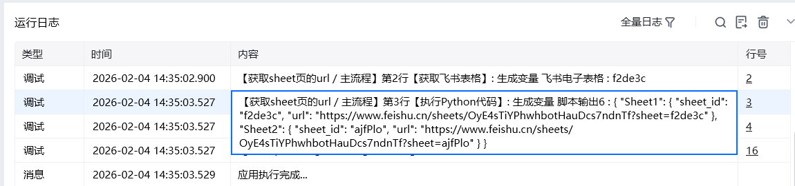

## 一、指令概述

用于根据飞书表格根 URL，获取指定 Sheet 页的专属访问 URL；若不指定 Sheet 页名称，则返回表格内<strong>所有 Sheet 页</strong>专属访问 URL
## 二、调用参数配置参数名称配置说明约束规则飞书访问凭证飞书开放平台的访问凭证，用于接口身份认证必填；可通过本指令集内「获取飞书访问凭证」指令获取，需确保凭证在有效期内飞书表格 URL飞书在线表格的根访问链接（不含 Sheet 页后缀）必填；需为有效飞书表格链接，且凭证对应账号具备该表格的访问权限Sheet 页名称目标 Sheet 页的名称选填；不填写时默认返回表格内所有 Sheet 页的 URL 信息；填写时需与表格内 Sheet 页名称完全一致（区分大小写）生成变量存储指令输出结果的变量名称必填；用于承接指令返回的字典数据，供下游指令调用
## 三、输出说明

## 四、典型操作示例
### 示例 1：获取表格内所有 Sheet 页的 URL 列表

1、填写飞书访问凭证：可通过「获取飞书访问凭证」指令获取

2、填写飞书表格URL: 填写自己的飞书表格URL

3、生成变量：如：\{ "Sheet1": \{ "sheet_id": "f2", "url": "https://www.feishu.cn/sheets/OyE4sTnTf?sheet=f2c" \}, "Sheet2": \{ "sheet_id": "ajfP", "url": "https://www.feishu.cn/sheets/OyE4sTiYPhwhbotaf?sheet=ajfP" \} \}

<Info>
  使用指令过程中遇到问题？前往 [八爪鱼RPA 开发者社区问答板块](https://rpa.bazhuayu.com/community/questions) 提问，获取官方与社区帮助。
</Info>
