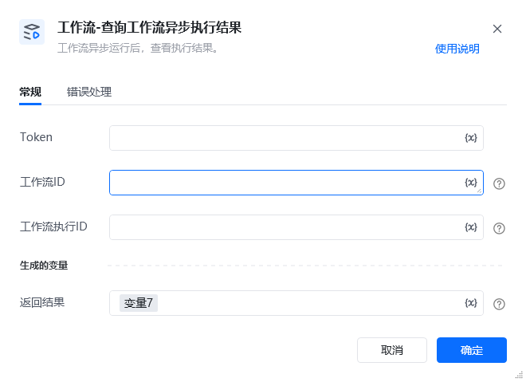

## 1、功能说明

该指令用于查询扣子平台中<strong>异步运行工作流</strong>的最终执行结果。需传入异步执行时返回的execute_id和对应的工作流ID，支持查看执行状态、输出内容、资源消耗等信息，API 调用失败时指令会抛出错误。

API 接口详细信息见：https://www.coze.cn/open/docs/developer_guides/workflow_history[https://www.coze.cn/open/docs/developer_guides/workflow_history](https://www.coze.cn/open/docs/developer_guides/workflow_history)
## 2、配置参数

参数名必填说明Token是用于身份鉴权的访问令牌，需开通listRunHistory权限，鉴权规则参考扣子平台规范。工作流 ID是异步运行的目标工作流唯一标识，可从工作流编排页面 URL 中获取（workflow参数后数字）。工作流执行 ID是异步执行工作流时返回的唯一 ID（即execute_id），用于定位具体执行记录。返回结果是接口返回的完整响应内容，为字典格式，包含执行状态、输出结果等信息。

<strong>返回结果示例</strong>

<strong>1. 执行成功响应</strong>\{
"code": 0,
"msg": "",
"data": [
\{
"execute_id": "743104097880585****",
"execute_status": "Success",
"output": "\{\"Output\":\"工作流异步执行完成，处理结果：生成10条数据报告\",\"数据统计节点\":\"处理数据总量200条，成功198条\"\}",
"create_time": 1730174063,
"update_time": 1730174065,
"usage": \{
"input_count": 80,
"output_count": 120,
"token_count": 200
\},
"debug_url": "https://www.coze.cn/work_flow?execute_id=743104097880585****&space_id=730976060439760****&workflow_id=742963539464539****",
"logid": "20241029115423ED85C3401395715F726E"
\}
],
"detail": \{
"logid": "20241029152003BC531DC784F1897B****"
\}
\}

<strong>2. 执行中响应</strong>\{
"code": 0,
"msg": "",
"data": [
\{
"execute_id": "743104097880585****",
"execute_status": "Running",
"output": "",
"create_time": 1730174063,
"update_time": 1730174070,
"usage": \{
"input_count": 80,
"output_count": 0,
"token_count": 80
\},
"debug_url": "https://www.coze.cn/work_flow?execute_id=743104097880585****&space_id=730976060439760****&workflow_id=742963539464539****",
"logid": "20241029115423ED85C3401395715F726E"
\}
],
"detail": \{
"logid": "20241029152003BC531DC784F1897B****"
\}
\}

## 3、示例场景

<strong>场景：查询长耗时工作流异步执行结果</strong>从 “执行工作流” 指令的异步响应中，提取execute_id（如743104097880585****）和对应的工作流ID。在本指令的 “Token” 参数中填入有效鉴权令牌，“工作流 ID” 和 “执行 ID（execute_id）” 分别填入上述提取的值。运行指令，若返回execute_status: "Success"，可从output字段解析工作流输出结果；若为 “Running”，需等待一段时间后重新查询；若API调用失败，指令会抛出错误，可以通过指令错误信息排查失败原因。

<Info>
  使用指令过程中遇到问题？前往 [八爪鱼RPA 开发者社区问答板块](https://rpa.bazhuayu.com/community/questions) 提问，获取官方与社区帮助。
</Info>
