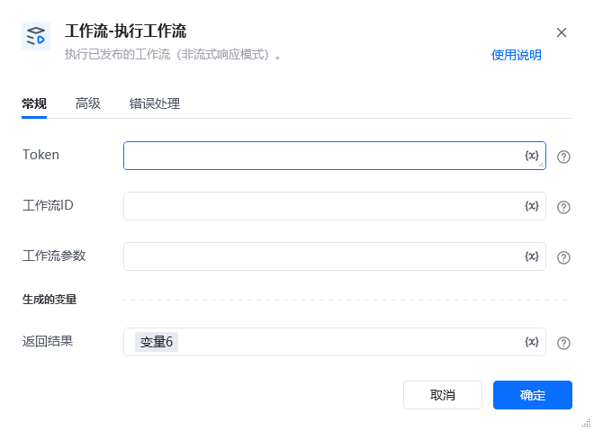
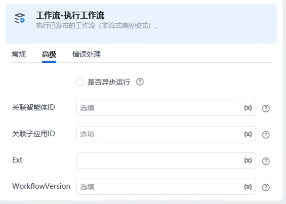

## 1、功能说明

该指令用于执行已在扣子平台发布的工作流，采用<strong>非流式响应模式</strong>。扣子个人付费版、企业版（企业标准版、企业旗舰版）用户支持通过是否异步运行参数开启异步执行，适用于耗时较长的工作流（避免运行超时）；异步运行后需通过返回的execute_id调用 “查询工作流异步执行结果” 指令获取结果。

API 详细说明见：https://www.coze.cn/open/docs/developer_guides/workflow_run[https://www.coze.cn/open/docs/developer_guides/workflow_run](https://www.coze.cn/open/docs/developer_guides/workflow_run)

鉴权说明见：https://www.coze.cn/open/docs/developer_guides/authentication[https://www.coze.cn/open/docs/developer_guides/authentication](https://www.coze.cn/open/docs/developer_guides/authentication)

## 2、配置参数

### 常规标签参数名必填说明Token是用于身份鉴权的令牌，需符合扣子平台的鉴权规则。工作流 ID是已发布工作流的唯一标识，可在扣子平台的工作流管理页获取。工作流参数否工作流运行所需的输入参数，格式需与工作流定义的参数一致。返回结果是工作流执行后的完整响应，为字典格式。
### 高级标签参数名必填说明是否异步运行否仅扣子个人付费版、企业版用户可用；勾选后开启异步执行模式，适用于耗时较长的工作流。关联智能体 ID否选填，关联的智能体唯一标识。关联子应用 ID否选填，关联的子应用唯一标识。Ext否选填，自定义扩展参数，用于传递额外信息。WorkflowVersion否选填，指定要执行的工作流版本号，默认使用最新版本。

<strong>返回结果示例</strong>

<strong>同步执行成功响应</strong>\{
"code": 0,
"msg": "success",
"data": \{
"run_id": "wr_92e3xxxxxxxxx",
"workflow_id": "wf_6a8dxxxxxxxxx",
"status": "SUCCEEDED",
"outputs": \{
"result": "工作流执行完成，处理数据10条",
"total_count": 10
\},
"start_time": "2026-02-06T14:30:00Z",
"end_time": "2026-02-06T14:30:15Z"
\}
\}
#### 异步执行成功响应（勾选 “是否异步运行”）\{
"code": 0,
"msg": "success",
"data": \{
"execute_id": "we_7b9fxxxxxxxxx",
"workflow_id": "wf_6a8dxxxxxxxxx",
"status": "PENDING",
"is_async": true
\}
\}

（需通过execute_id调用 “查询工作流异步执行结果” API 获取最终结果）

当调用API接口失败时，指令会抛出错误。
## 3、示例场景

<strong>场景 1：同步执行短耗时工作流</strong>填写Token和目标工作流ID。（可选）填写工作流参数。不勾选 “是否异步运行”，直接运行指令。等待工作流执行完成，通过返回结果查看输出内容。

<strong>场景 2：异步执行长耗时工作流（个人付费 / 企业版用户）</strong>填写Token和目标工作流ID。勾选 “是否异步运行” 复选框。运行指令，获取返回结果中的execute_id（如we_7b9fxxxxxxxxx）。调用 “查询工作流异步执行结果” 指令，传入execute_id获取最终执行状态与输出。

<Info>
  使用指令过程中遇到问题？前往 [八爪鱼RPA 开发者社区问答板块](https://rpa.bazhuayu.com/community/questions) 提问，获取官方与社区帮助。
</Info>
