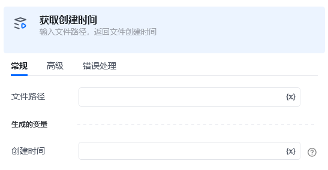
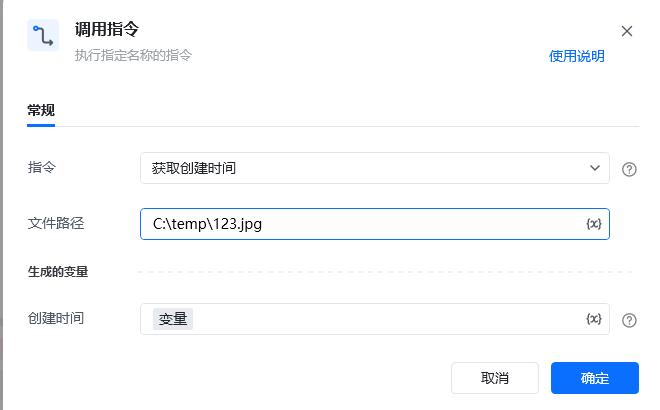
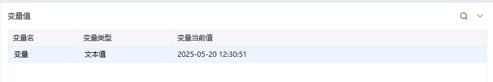

### <strong>获取</strong>创建时间

<strong>描述：</strong>

<strong>输入：</strong>

文件路径，例：D:\新文件夹

文件名，可输入文件名或文件夹名，例：test.xlsx

<strong>输出：</strong>

文件路径，拼接后的文件路径，例：D:\新文件夹\test.xlsx

<strong>使用示例：</strong>

运行效果

<Info>
  使用指令过程中遇到问题？前往 [八爪鱼RPA 开发者社区问答板块](https://rpa.bazhuayu.com/community/questions) 提问，获取官方与社区帮助。
</Info>
