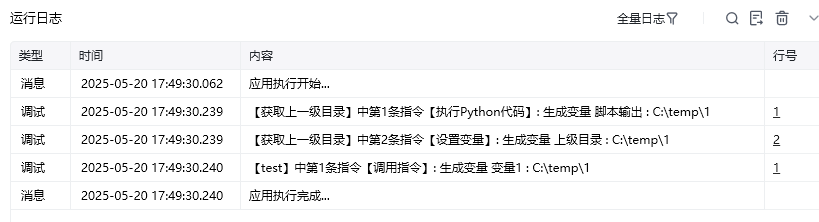

###
<strong>获取上一级目录</strong>

<strong>输入：</strong>

文件路径，例：C:\temp\1\2

<strong>输出：</strong>

上级目录，例：C:\temp\1

<strong>使用示例：</strong>

<strong>运行效果</strong>

<Info>
  使用指令过程中遇到问题？前往 [八爪鱼RPA 开发者社区问答板块](https://rpa.bazhuayu.com/community/questions) 提问，获取官方与社区帮助。
</Info>
