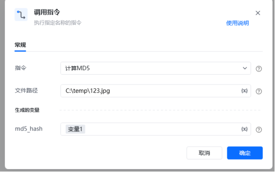
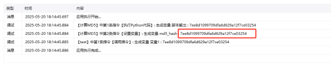

<strong>计算MD5</strong>

<strong>描述</strong>

计算输入文件的 MD5 哈希值。

<strong>使用示例：</strong>

<strong>运行效果</strong>

<Info>
  使用指令过程中遇到问题？前往 [八爪鱼RPA 开发者社区问答板块](https://rpa.bazhuayu.com/community/questions) 提问，获取官方与社区帮助。
</Info>
