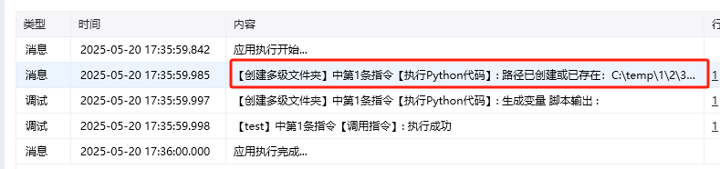

### 创建多级文件夹
### 描述

一次性创建输入的路径中所有不存在的文件夹

### 描述

一次性创建输入的路径中所有不存在的文件夹。

<strong>输入</strong>

文件夹路径

<strong>使用示例</strong>

<strong>执行效果</strong>

<Info>
  使用指令过程中遇到问题？前往 [八爪鱼RPA 开发者社区问答板块](https://rpa.bazhuayu.com/community/questions) 提问，获取官方与社区帮助。
</Info>
