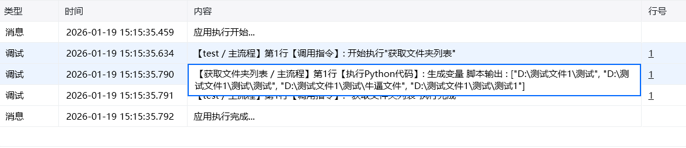

## 一、指令概述

用于批量获取指定目录下的文件夹列表，支持子文件夹递归查询、隐藏文件夹过滤及自定义排序规则，适用于文件管理、批量处理等场景，可提升目录遍历与整理的效率。

## 二、调用参数配置参数名称配置说明约束规则文件夹目标目录路径，可通过 “选择文件夹” 按钮选取或手动输入绝对路径必填；需确保路径存在且具备读取权限查找子文件夹勾选后递归查询目标目录下的所有子文件夹选填；默认不勾选忽略隐藏的文件夹勾选后过滤系统 / 用户隐藏的文件夹选填；默认不勾选指定文件夹列表排序规则勾选后启用自定义排序功能，需配合 “排序因素”“排序规则” 使用选填；默认不勾选排序因素排序的依据维度，可选：文件名称、文件大小、文件夹创建时间、文件夹最后修改时间选填；仅当 “指定文件夹列表排序规则” 勾选时可用排序规则排序的方向，可选：顺序、倒序选填；仅当 “指定文件夹列表排序规则” 勾选时可用
## 三、运行结果

输出获取到的文件夹列表

## 四、典型操作示例

<Info>
  使用指令过程中遇到问题？前往 [八爪鱼RPA 开发者社区问答板块](https://rpa.bazhuayu.com/community/questions) 提问，获取官方与社区帮助。
</Info>
