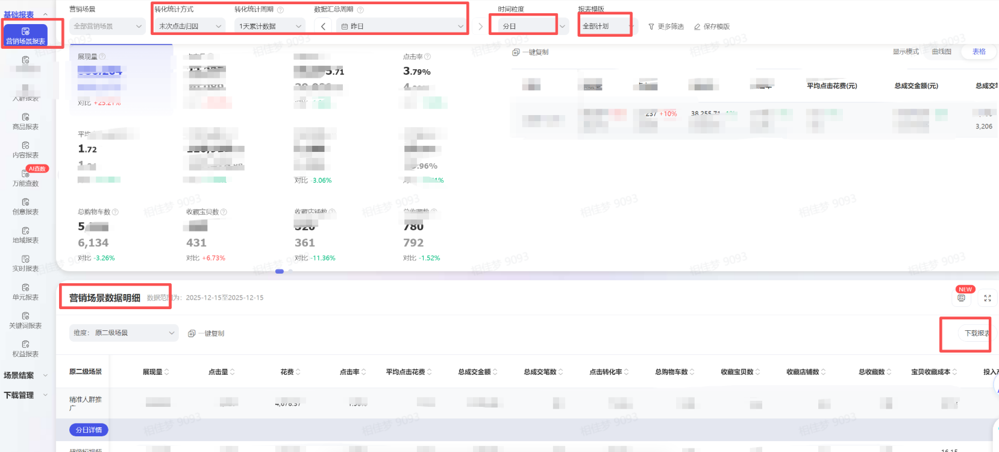
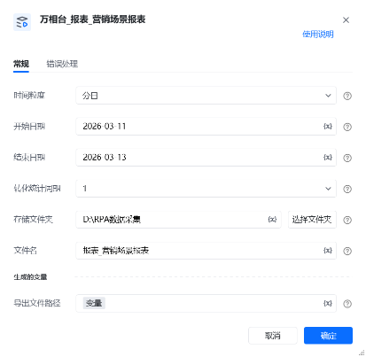
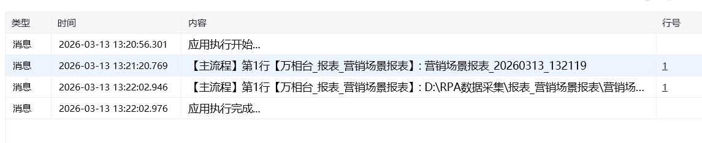

指令说明：

指令参数说明：

<strong>时间粒度：</strong>

下拉框，可选：分日、分周、分月

<strong>转化统计周期：</strong>

下拉框，可选：一天累计、3天累计、7天累计、15天累计、30天累计

<strong>开始日期：</strong>

指定开始日期进行数据获取下载，例：2026-02-15

<strong>结束日期：</strong>

指定开始日期进行数据获取下载，例：2026-02-28

<strong>存储文件夹</strong>：

下载或生成文件保存的文件夹路径

<strong>文件夹：</strong>

下载或生成文件保存的名称
# <strong>指令输出说明</strong>

<strong>导出文件路径：</strong>

返回文本类型，完整的文件下载路径
# 使用示例

# 运行结果

<Info>
  使用指令过程中遇到问题？前往 [八爪鱼RPA 开发者社区问答板块](https://rpa.bazhuayu.com/community/questions) 提问，获取官方与社区帮助。
</Info>
