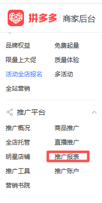
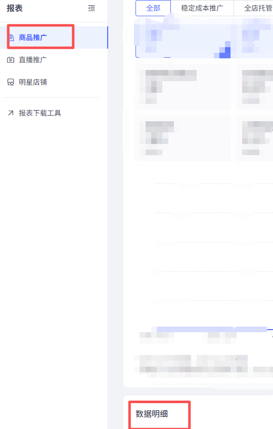

## 一、指令概述

该指令实现了获取商品推广板块中的推广商品数据

## 二、调用参数配置参数名称描述配置规则备注网页对象选择已加载的 “商品推广 - 数据明细 - 推广商品” 页面对象下拉选择已定义的网页对象必填具体日期类型选择数据的时间范围类型单选框选项：- 今日- 昨日- 近 7 日- 近 30 日- 近 90 日- 自定义（需填写开始 / 结束时间）必填开始时间自定义时间范围的起始日期输入格式：YYYY-MM-DD，仅当 “具体日期类型” 为 “自定义” 时显示并必填选填（仅 “自定义” 时必填）结束时间自定义时间范围的结束日期输入格式：YYYY-MM-DD，仅当 “具体日期类型” 为 “自定义” 时显示并必填；需晚于开始时间，且不晚于当前日期选填（仅 “自定义” 时必填）自定义路径数据文件的保存目录点击 “选择文件夹” 按钮选取本地路径必填推广场景筛选数据的推广场景维度输入与平台一致的场景名称，选填项选填分组筛选数据的分组维度输入与平台一致的分组名称，选填项选填出价方式筛选数据的出价方式维度输入与平台一致的出价方式名称，选填项选填自定义文件名称数据文件的名称输入自定义文件名（无需后缀），选填项选填生成路径数据文件实际保存路径对应的变量配置变量名，用于记录文件存储位置选填
## 三、使用示例
示例 1：提取近 30 日搜索推广场景下的商品明细数据网页对象：选择 “商品推广 - 数据明细 - 推广商品页面”；具体日期类型：选择 “近 30 日”；推广场景：输入 “搜索推广”；自定义路径：选择目标保存目录（如D:\推广商品明细数据）；自定义文件名称：输入 “近 30 日搜索推广商品明细”；执行指令后，系统将提取对应数据并保存到指定路径。
## 四、运行效果

指令执行后，从对应页面获取指定维度的推广商品明细数据（如商品 ID、曝光量、点击量、ROI 等），生成文件并保存到自定义路径，支持单商品推广效果的精细化评估。

<Info>
  使用指令过程中遇到问题？前往 [八爪鱼RPA 开发者社区问答板块](https://rpa.bazhuayu.com/community/questions) 提问，获取官方与社区帮助。
</Info>
