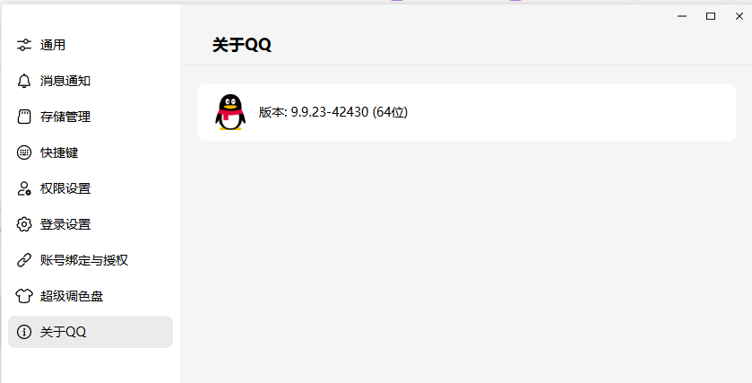
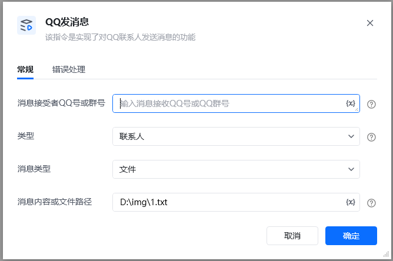
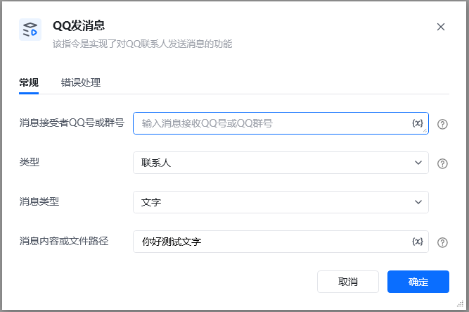
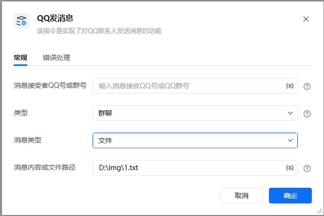

注：使用前请先打开QQ本次测试QQ版本如下

【目前只支持版本: 9.9.23-42430 (64位)】

界面模式设置为【效率模式】

该指令实现了对QQ联系人或群组发送消息的功能

### 指令输入

<strong>消息接收者QQ号/群号: </strong> 填写qq号或者QQ群号

<strong>类型：</strong>选择群组或联系人

<strong>消息类型：</strong>选择文字/文件

<strong>消息内容/文件路径：</strong>发送的消息内容
## 参考案列
### 场景1

<strong>场景描述</strong>

给好友发送一条文字消息

### 场景2

<strong>场景描述</strong>

给群聊发送一个文件消息

<strong>执行结果</strong>

<Info>
  使用指令过程中遇到问题？前往 [八爪鱼RPA 开发者社区问答板块](https://rpa.bazhuayu.com/community/questions) 提问，获取官方与社区帮助。
</Info>
