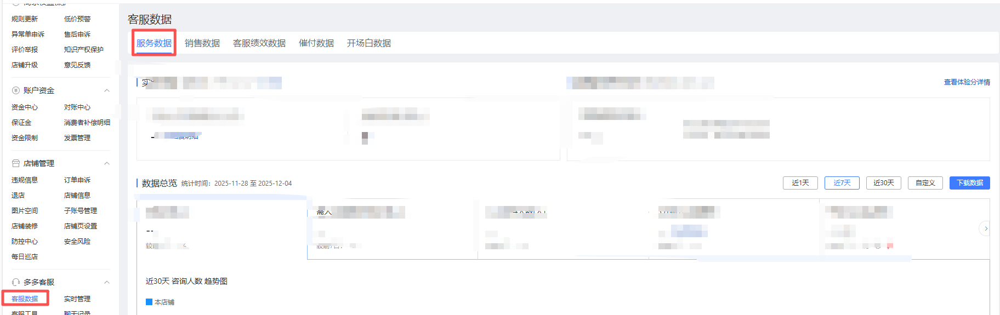
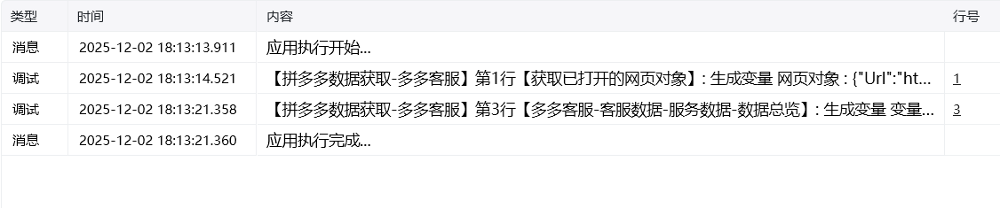

## 一、指令概述

用于从 “多多客服” 页面提取指定时间范围的服务数据，并将数据保存到自定义路径下的文件中，支持预设时间范围（近 1 天 / 7 天 / 30 天）与自定义时间范围的灵活选择，适用于客服服务数据的定时导出与统计场景。

## 二、调用参数配置标签页参数名称描述配置规则备注常规网页对象选择待操作的 “多多客服” 页面所属的网页对象下拉选择已定义的网页对象必填常规具体日期选择选择数据的时间范围类型单选框选项：- 近 1 天- 近 7 天- 近 30 天- 自定义必填常规开始时间自定义时间范围的起始日期填写日期（仅当 “具体日期选择” 为 “自定义” 时显示并必填）⚠️ 限制：结束时间 ≤ 当前日期，且需在 “当前日期 - 2 个月” 的时间范围内选填（仅 “自定义” 时必填）常规结束时间自定义时间范围的结束日期填写日期（仅当 “具体日期选择” 为 “自定义” 时显示并必填）,⚠️ 限制：结束时间 ≤ 当前日期，且需在 “当前日期 - 2 个月” 的时间范围内选填（仅 “自定义” 时必填）常规自定义路径数据文件的保存路径输入路径或点击 “选择文件夹” 按钮选取保存目录必填高级自定义文件名称数据文件的名称（默认使用系统生成名称）输入自定义文件名（如 “客服数据_202506”），不填则使用默认名称选填
## 三、使用示例
示例 1：提取近 7 天数据网页对象：选择 “多多客服页面”；具体日期选择：选择 “近 7 天”；自定义路径：选择保存目录（如D:/客服数据）；执行指令后，系统将自动提取近 7 天的服务数据并保存到指定路径。
示例 2：提取自定义时间范围数据网页对象：选择 “多多客服页面”；具体日期选择：选择 “自定义”；开始时间：2025-05-01；结束时间：2025-05-31；自定义路径：选择保存目录（如D:/客服数据）；自定义文件名称：输入 “5 月客服数据”；执行指令后，系统将提取 5 月全月数据并以 “5 月客服数据” 为名保存。
## 四、运行效果

指令执行后，将自动从 “多多客服” 页面获取指定时间范围的服务数据（如咨询量、响应时长等），并生成文件保存到自定义路径下，可直接用于后续数据统计与分析。

<Info>
  使用指令过程中遇到问题？前往 [八爪鱼RPA 开发者社区问答板块](https://rpa.bazhuayu.com/community/questions) 提问，获取官方与社区帮助。
</Info>
