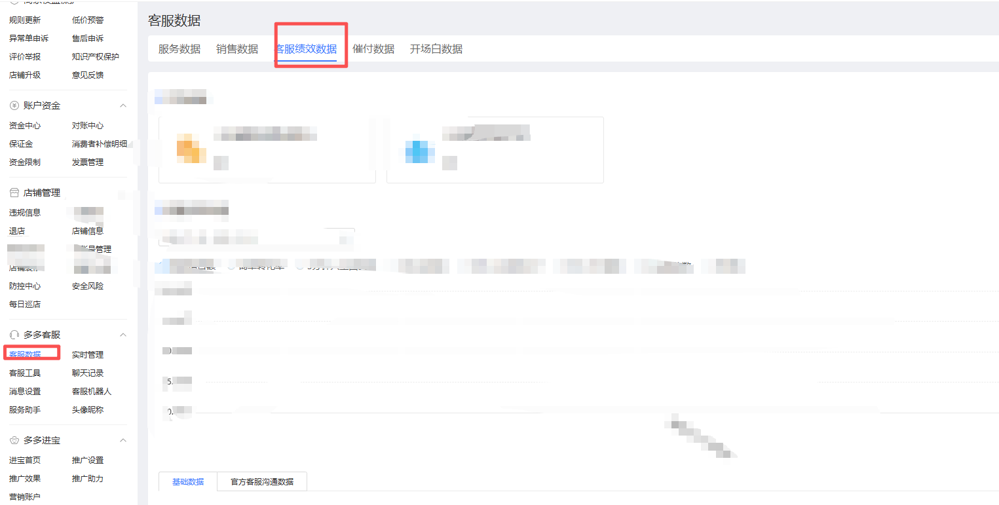
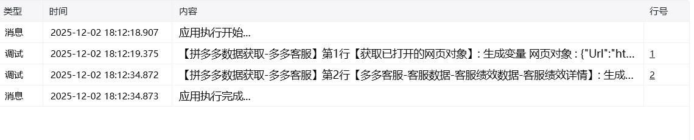

## 一、指令概述

用于从 “多多客服” 页面提取客服绩效相关数据，并将数据保存到指定路径。支持预设时间范围（近 1 天 / 7 天 / 30 天）与自定义时间范围，<strong>核心限制：单次采集时间间隔最长为 1 个月，且仅支持爬取当前时间往前推 2 个月内的数据</strong>，适用于客服绩效的短期统计与分析场景。

## 二、调用参数配置标签页参数名称描述配置规则备注常规网页对象选择 “多多客服” 页面对应的网页对象下拉选择已定义的网页对象必填常规具体日期选择选择数据的时间范围类型单选框选项：- 近 1 天- 近 7 天- 近 30 天- 自定义（需满足时间限制）必填常规开始时间自定义时间范围的起始日期填写日期（仅 “自定义” 时显示并必填）；⚠️ 限制：开始时间 ≥ 当前日期 - 2 个月，且结束时间 - 开始时间 ≤ 30 天（单次最长 1 个月）选填（仅 “自定义” 时必填）常规结束时间自定义时间范围的结束日期填写日期（仅 “自定义” 时显示并必填）；⚠️ 限制：结束时间 ≤ 当前日期，且不超过开始时间 + 30 天选填（仅 “自定义” 时必填）常规自定义路径数据文件的保存路径输入路径或点击 “选择文件夹” 按钮选取保存目录（如示例中的 “D:\ 测试文件”）必填常规生成路径数据文件的最终输出路径变量配置变量名，用于存储文件实际保存路径选填高级自定义文件名称数据文件的自定义名称输入文件名（如 “202507 客服绩效数据”），不填则使用系统默认名称选填
## 三、使用示例

以当前日期为 2025-08-10，爬取 2025-07-01 至 2025-07-31（1 个月，且在近 2 个月内）的数据为例：网页对象：选择 “多多客服页面”；具体日期选择：选择 “自定义”；开始时间：2025-07-01；结束时间：2025-07-31（与开始时间间隔 30 天，符合限制）；自定义路径：选择 “D:\ 测试文件”；自定义文件名称：输入 “2025 年 7 月客服绩效详情”；执行指令后，系统将提取该时间段数据并保存到指定路径。
## 四、运行效果

指令执行后，自动从 “多多客服” 页面获取指定时间范围的绩效数据，生成文件并保存到自定义路径。若时间范围超出 “近 2 个月” 或 “单次 1 个月” 的限制，将提示错误并终止执行。

<Info>
  使用指令过程中遇到问题？前往 [八爪鱼RPA 开发者社区问答板块](https://rpa.bazhuayu.com/community/questions) 提问，获取官方与社区帮助。
</Info>
