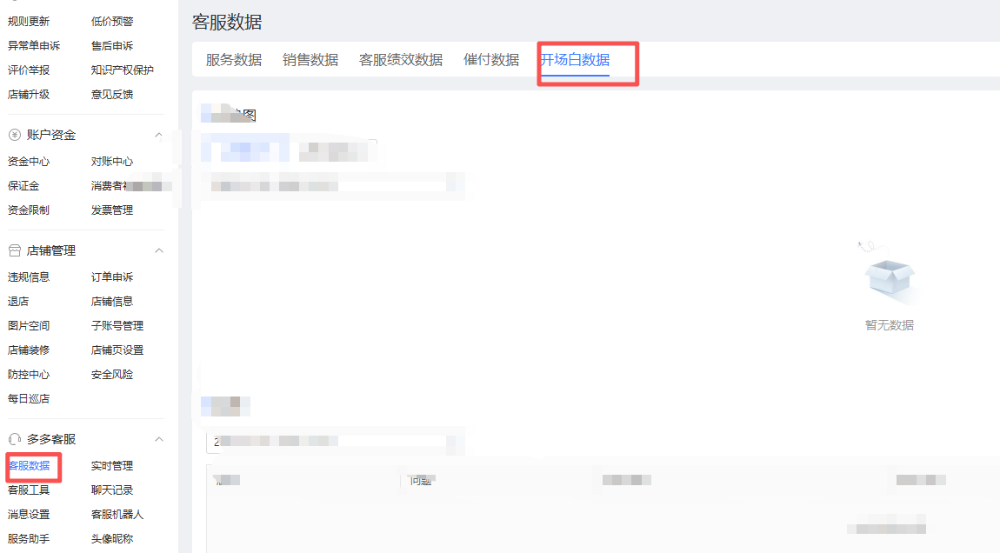
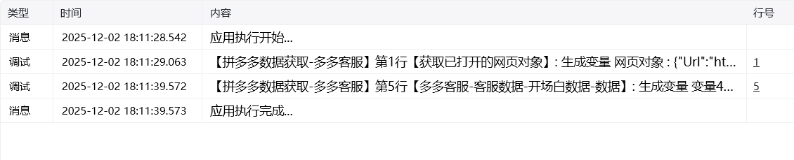

## 一、指令概述

用于从 “多多客服” 页面提取开场白相关的服务数据，并将数据保存到指定路径。支持预设时间范围（近 1 天 / 7 天 / 30 天）与自定义时间范围，<strong>核心功能：支持爬取近半年（6 个月内）的历史数据</strong>，适用于长期开场白数据的统计与分析场景。

## 二、调用参数配置标签页参数名称描述配置规则备注常规网页对象选择 “多多客服” 页面对应的网页对象下拉选择已定义的网页对象必填常规具体日期选择选择数据的时间范围类型单选框选项：- 近 1 天- 近 7 天- 近 30 天- 自定义（支持选择近 6 个月内任意时间段）必填常规开始时间自定义时间范围的起始日期填写日期（仅 “自定义” 时显示并必填）；⚠️ 限制：开始时间 ≥ 当前日期 - 6 个月，且早于结束时间选填（仅 “自定义” 时必填）常规结束时间自定义时间范围的结束日期填写日期（仅 “自定义” 时显示并必填）；⚠️ 限制：结束时间 ≤ 当前日期，且晚于开始时间选填（仅 “自定义” 时必填）常规自定义路径数据文件的保存路径输入路径或点击 “选择文件夹” 按钮选取保存目录必填高级自定义文件名称数据文件的自定义名称（默认使用系统生成名称）输入文件名（如 “2025 年 1-6 月开场白数据”），不填则默认生成包含时间范围的文件名选填
## 三、使用示例

以当前日期为 2025-08-10，爬取近半年（2025-02-10 至 2025-08-10）数据为例：网页对象：选择 “多多客服页面”；具体日期选择：选择 “自定义”；开始时间：2025-02-10（当前日期 - 6 个月，符合限制）；结束时间：2025-08-10（不晚于当前日期）；自定义路径：选择保存目录（如D:/客服数据/开场白）；自定义文件名称：输入 “2025 年 2-8 月开场白数据”；执行指令后，系统将提取近半年数据并保存到指定路径。
## 四、运行效果

指令执行后，自动从 “多多客服” 页面获取指定时间范围的开场白数据（如开场白使用率、客户响应率等），并生成文件保存到自定义路径。若时间范围超出近半年限制，将提示错误并终止执行。

<Info>
  使用指令过程中遇到问题？前往 [八爪鱼RPA 开发者社区问答板块](https://rpa.bazhuayu.com/community/questions) 提问，获取官方与社区帮助。
</Info>
