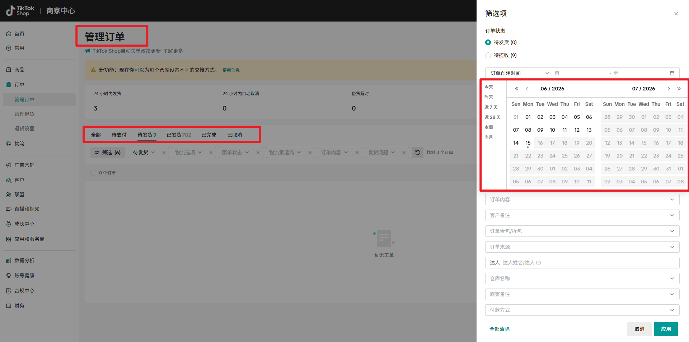

# 一、应用介绍

该指令用于在管理订单页导出数据。网址： https://seller.tiktokshopglobalselling.com/order[https://seller.tiktokshopglobalselling.com/order](https://seller.tiktokshopglobalselling.com/order)

筛选范围：

1、导出类型全部、待支付、代发货、已发货....

2、日期范围：快捷日期、自定义日期

3、导出格式：CSV、EXCEL

# 二、应用入参

网页对象：传入打开的管理订单页网页对象。

导出类型：输入类型：全部、待支付、待发夥、已发货、已完成、已取消

日期选择：输入：快捷日期、自定义日期

导出格式：文件导出格式，输入：CSV、Excel

开始日期：格式：YYYY-MM-DD；例：2026-05-10

结束日期：格式：YYYY-MM-DD；例：2026-05-20

快捷日期：输入：今天、昨天、近7天、近28天、本周、当月

文件保存路径：选择文件保存的路径。

高级：

等待文件下载时长：等待文件生成和下载的时间，秒
# 三、输出结果

下载文件路径：返回下载下来的文件路径。

<Info>
  使用指令过程中遇到问题？前往 [八爪鱼RPA 开发者社区问答板块](https://rpa.bazhuayu.com/community/questions) 提问，获取官方与社区帮助。
</Info>
