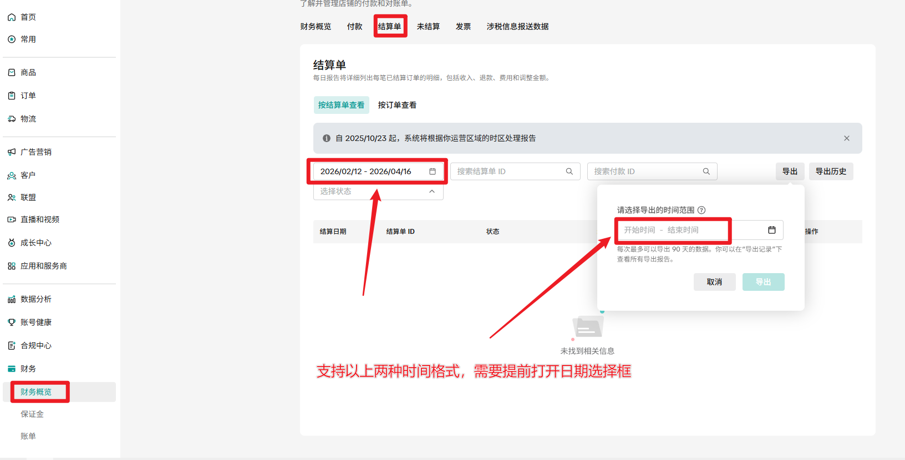

## 一、指令概述

## 二、核心参数配置参数名称说明输入格式 / 规则网页对象已登录 Tiktok 后台的浏览器网页对象必填开始时间筛选数据的起始日期 自定义：格式为YYYY-MM-DD结束时间筛选数据的结束日期自定义：格式为YYYY-MM-DD，且必须晚于或等于开始时间
## 三、典型操作示例

<Info>
  使用指令过程中遇到问题？前往 [八爪鱼RPA 开发者社区问答板块](https://rpa.bazhuayu.com/community/questions) 提问，获取官方与社区帮助。
</Info>
