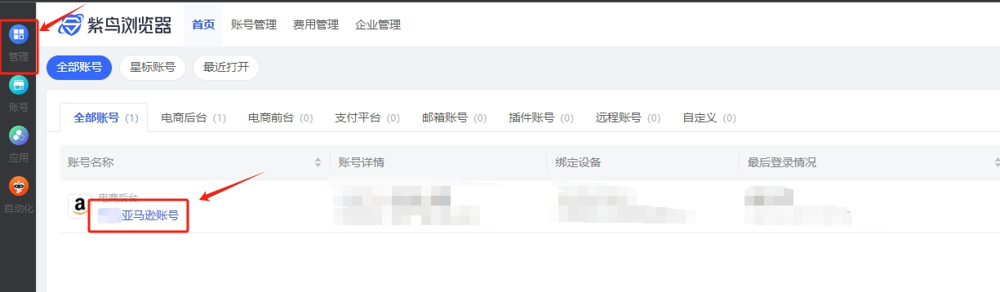

输入所属平台
输出store_name_list
# 使用说明
## 1、功能

在紫鸟浏览器环境管理页面获取指定平台的所有店铺名称

## 2、采集字段

无
## 3、输出结果

<Info>
  使用指令过程中遇到问题？前往 [八爪鱼RPA 开发者社区问答板块](https://rpa.bazhuayu.com/community/questions) 提问，获取官方与社区帮助。
</Info>
