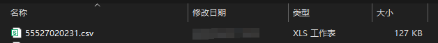

输入网页对象：紫鸟浏览器网页对象下载按钮：触发下载文件的元素按钮保存文件夹：下载文件保存的文件夹保存文件名：下载文件保存的文件名等待对话框出现：等待下载对话框出现的超时时间，单位是秒（s）超时时间：等待文件下载的时间，超出这个时间将会抛出异常，单位是秒（s）
输出download_file_name：下载的文件的完整路径
# 使用说明
## 1、功能

该指令实现了紫鸟浏览器网页端的文件下载操作

## 2、采集字段

无
## 3、输出结果

<Info>
  使用指令过程中遇到问题？前往 [八爪鱼RPA 开发者社区问答板块](https://rpa.bazhuayu.com/community/questions) 提问，获取官方与社区帮助。
</Info>
