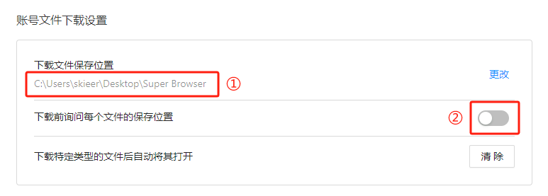

输入无
输出下载文件保存位置：返回紫鸟浏览器中的”下载文件保存路径“是否询问保存位置：若该按钮打开，则返回”是“；若该按钮关闭，则返回”否“
# 使用说明
## 1、功能

获取紫鸟浏览器默认下载文件保存位置

## 2、采集字段

无
## 3、输出结果

<Info>
  使用指令过程中遇到问题？前往 [八爪鱼RPA 开发者社区问答板块](https://rpa.bazhuayu.com/community/questions) 提问，获取官方与社区帮助。
</Info>
