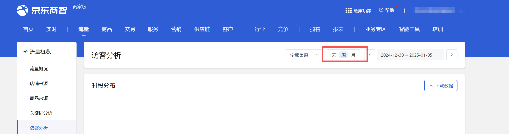

# 描述

该指令实现京东商智商家版流量-访客分析页面的时间自动选择

# 配置项说明
## 指令输入
#### 网页对象：

任意已登录京东商智商家版后台的流量-访客分析页面的网页对象

<strong>时间查询方式:</strong>

下拉框，可选：天、周、月，必填项

<strong>具体日期：</strong>

<Info>
  使用指令过程中遇到问题？前往 [八爪鱼RPA 开发者社区问答板块](https://rpa.bazhuayu.com/community/questions) 提问，获取官方与社区帮助。
</Info>
