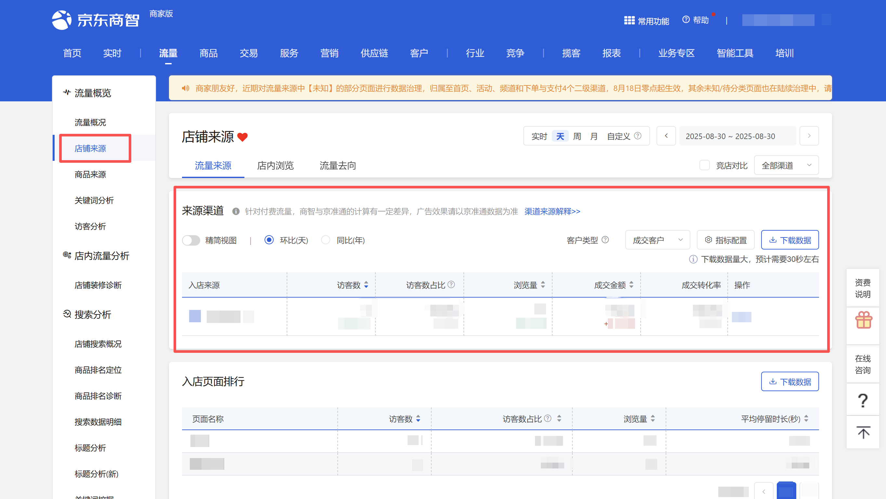
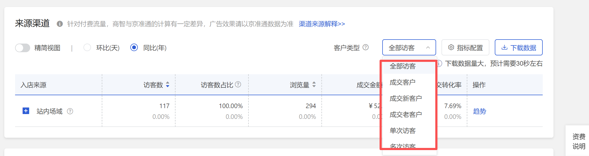
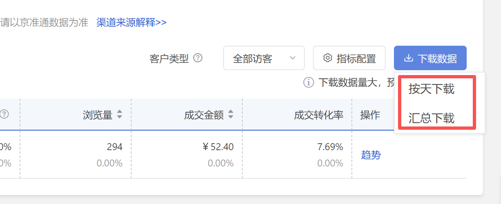
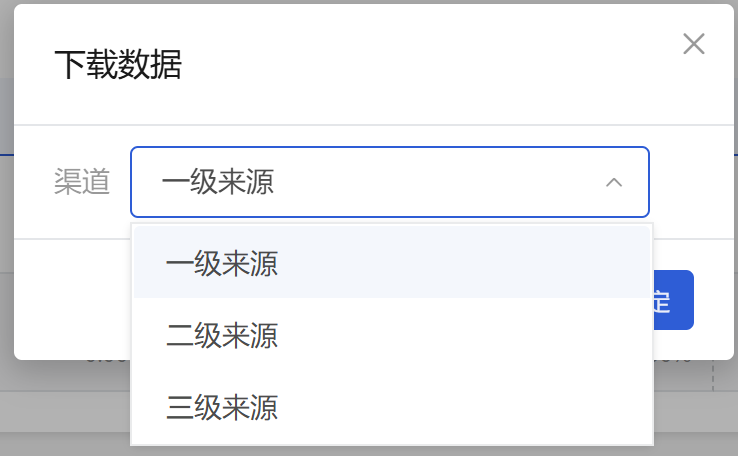
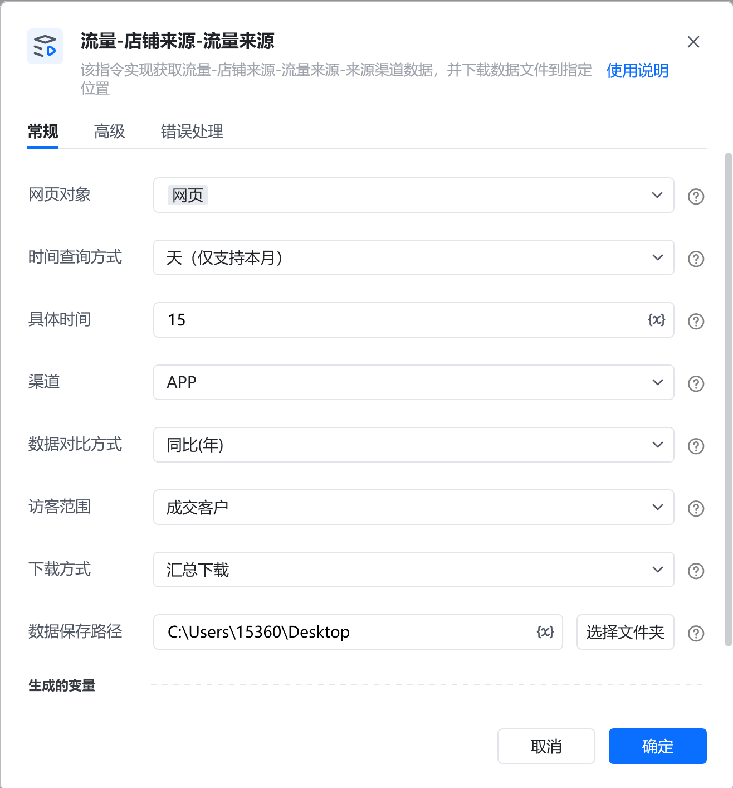
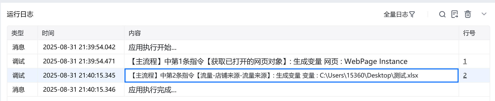

# 描述

该指令实现获取流量-店铺来源-流量来源-来源渠道数据，并下载数据文件到指定位置

# 配置项说明
## 指令输入
#### 网页对象：

任意已登录京东商智商家版后台的流量-店铺来源页面的网页对象

<strong>时间查询方式:</strong>

下拉框，可选：实时、天(仅支持本月)、周(仅支持本月)、月(仅支持本年)，选填，若不填则使用平台默认值

<strong>具体时间：</strong>

填写具体日期，格式：YYYY-MM-DD，例如：2025-08-01

<strong>自定义开始时间：</strong>

填写自定义开始日期，格式：YYYY-MM-DD，例如：2025-08-01。由于平台限制，开始日期与结束日期跨度不可超过31天

<strong>自定义结束时间：</strong>

填写自定义结束日期，格式：YYYY-MM-DD，例如：2025-08-01。由于平台限制，开始日期与结束日期跨度不可超过31天

<strong>渠道:</strong>

下拉框，可选：全部渠道、APP、PC、微信、手Q、M端，选填，若不填则使用平台默认值

<strong>数据对比方式:</strong>

下拉框，可选：环比(天)、同比(年)，选填，若不填则使用平台默认值

<strong>访客范围：</strong>

下拉框，可选：全部访客、成交客户、成交新客户、成交老客户、单次访客，选填，若不填则使用平台默认值

<strong>下载方式:</strong>

下拉框，可选：按天下载、汇总下载

<strong>选择下载来源:</strong>

下拉框，可选：一级来源、二级来源、三级来源，必填项

<strong>数据保存路径:</strong>

选择下载文件保存的文件夹路径
#### 自定义文件名:

输入文件下载的名称，选填，若不填则使用平台默认名称
## 指令输出

文件路径：下载或生成的文件路径
# 使用示例

# 运行结果

<Info>
  使用指令过程中遇到问题？前往 [八爪鱼RPA 开发者社区问答板块](https://rpa.bazhuayu.com/community/questions) 提问，获取官方与社区帮助。
</Info>
