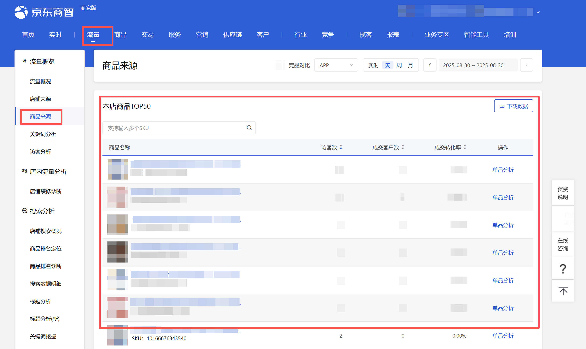
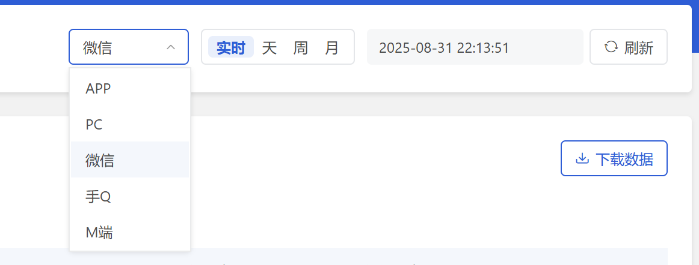
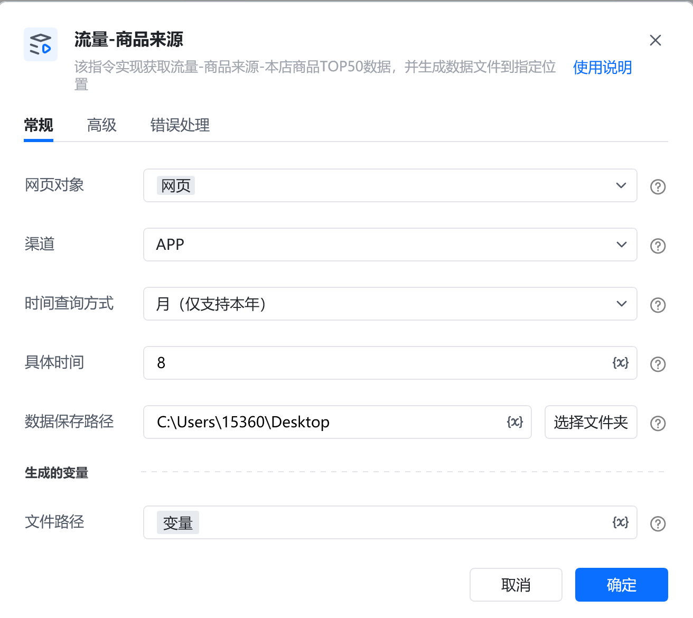
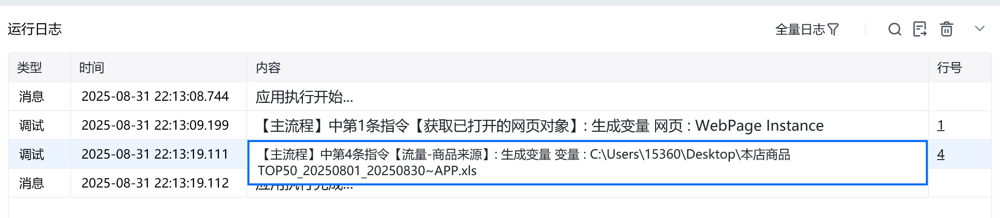
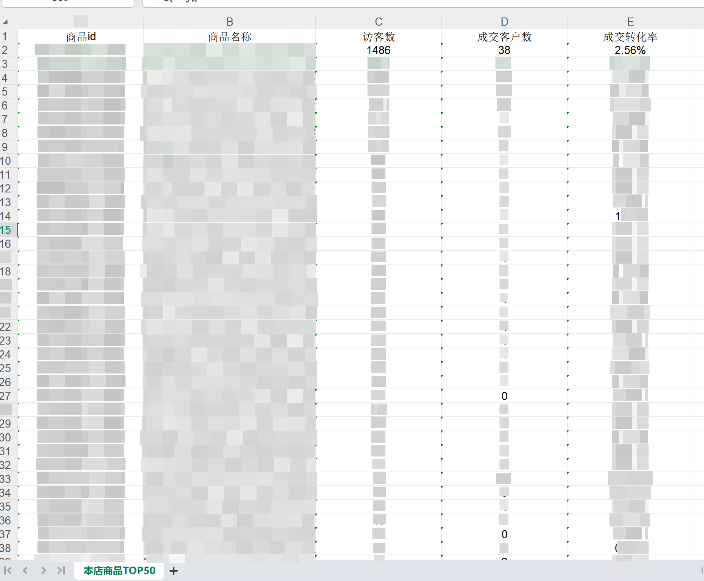

# 描述

该指令实现获取流量-商品来源-本店商品TOP50数据，并生成数据文件到指定位置

# 配置说明
## 输入

<strong>网页对象:</strong>

任意一个已登录京东商智商家版后台的流量-商品来源页面的网页对象

<strong>渠道:</strong>

下拉框，可选：APP、PC、微信、手Q、M端，选填，若不填则使用平台默认值

<strong>时间查询方式:</strong>

下拉框，可选：实时、天、周、月，选填，若不填则使用平台默认值

<strong>具体时间：</strong>

填写具体日期，格式：YYYY-MM-DD，例如：2025-08-01

<strong>数据保存路径:</strong>

选择数据类型，即下载文件保存的文件夹路径
#### 自定义文件名:

输入文件下载的名称，选填，若不填则使用平台默认名称
## 输出

<strong>文件路径：</strong>

数据类型为文本，输出指令获取的数据保存在本地的完整文件路径
# 使用示例

# 运行结果

<Info>
  使用指令过程中遇到问题？前往 [八爪鱼RPA 开发者社区问答板块](https://rpa.bazhuayu.com/community/questions) 提问，获取官方与社区帮助。
</Info>
