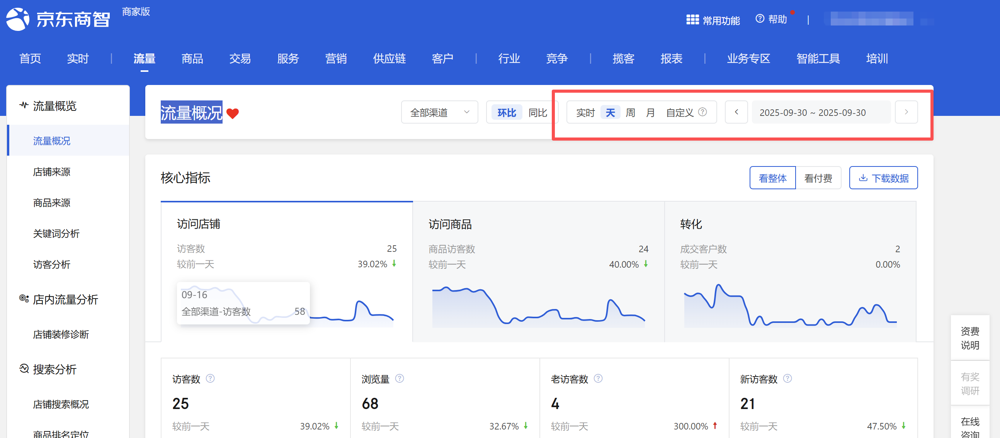

# 描述

该指令实现流量-流量概况页面的时间自动选择

# 配置项说明
## 指令输入
#### 网页对象：

该指令实现流量-流量概况页面的时间自动选择

<strong>时间查询方式:</strong>

下拉框，可选：实时、天、周、月、自定义，必填项

<strong>具体日期：</strong>

填写具体日期，格式：YYYY-MM-DD，例如：2025-08-01

<strong>自定义开始日期:</strong>

填写具体日期，格式：YYYY-MM-DD，例如：2025-08-01。由于平台限制，开始日期与结束日期跨度不可超过31天

<strong>自定义结束日期:</strong>

<Info>
  使用指令过程中遇到问题？前往 [八爪鱼RPA 开发者社区问答板块](https://rpa.bazhuayu.com/community/questions) 提问，获取官方与社区帮助。
</Info>
