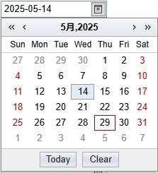
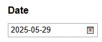
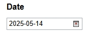

输入网页对象：选择一个之前通过【打开网页】或【获取已打开的网页对象】指令创建的网页对象日期相似元素组：web相似元素列表，包含当月所有具体日的日期大框从元素库中选择一个已捕获的元素作为操作目标如元素库还没有元素，可通过添加网页元素来捕获元素注意：这里应该选择日期的相似元素组，只要你的【相似元素组】包含你要点击的目标日期元素即可捕获后注意校验一下，你捕获的相似元素组中的元素，获取其元素信息，是否可以获取到对应的日期的值目标日期：待选择日期的文本，如想要选择当月9号，则应该在此框内填写9或09当月1号显示文本：单选框，参考时间框选择1或01
# 输出

无
# 使用说明
## 1、功能

用于自动选择网页中的目标日期

## 2、采集字段

无
## 3、输出结果

①流程执行前

①流程执行后

<Info>
  使用指令过程中遇到问题？前往 [八爪鱼RPA 开发者社区问答板块](https://rpa.bazhuayu.com/community/questions) 提问，获取官方与社区帮助。
</Info>
