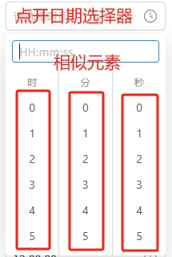
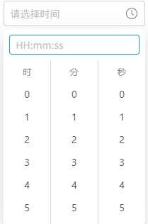

输入网页对象：当前进行时间选择操作的网页对象具体时间：想要勾选的时间。格式为HH-MM-SS，例(13-14-00)元素_点开日期选择器：触发时间选择框的元素(可为空)通用时_相似元素组：关于小时的相似元素组通用分_相似元素组：关于分钟的相似元素组通用秒_相似元素组：关于秒钟的相似元素组

# 输出

无
# 使用说明
## 1、功能

关于时分秒的选择

## 2、采集字段

无
## 3、输出结果

<Info>
  使用指令过程中遇到问题？前往 [八爪鱼RPA 开发者社区问答板块](https://rpa.bazhuayu.com/community/questions) 提问，获取官方与社区帮助。
</Info>
