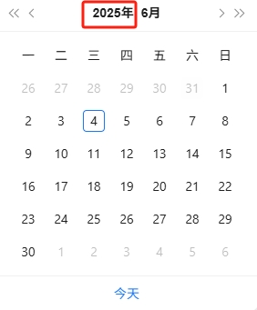
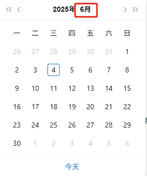
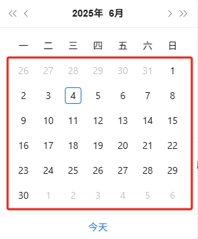
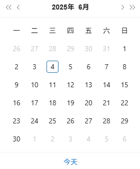

输入网页对象：选择需要进行时间选择的【网页对象】日期时间：填写需要选择的时间。填写规范：YYYY-MM-DD，如2025-06-04元素_年：捕获年份元素如下图所示，捕获年份元素，需要注意在元素编辑器中去掉 innertext=固定年份的勾选，如 innerText=2025 年，需要去除勾选，同时校验元素为 1 个

元素_月：捕获月份元素如下图所示，捕获月份元素，需要注意在元素编辑器中去掉 innertext=固定月份的勾选，如 innerText=6 月，需要去除勾选，同时校验元素为 1 个

年月日相似元素组：需要注意该指令适用于年/月/日期相似元素组能够通用的情况。捕获日期相似元素组，选择器上存在 42 个日期元素，则校验元素也应为 42 个

输出无
# 使用说明
## 1、功能

选择网页的日历日期，通用场景一

## 2、采集字段

无
## 3、输出结果

获取已打开的网页对象web_page --> 在网页web_page中选择日期(如2025-06-04) --> 网页对应时间选择定位到2025-06-04

<Info>
  使用指令过程中遇到问题？前往 [八爪鱼RPA 开发者社区问答板块](https://rpa.bazhuayu.com/community/questions) 提问，获取官方与社区帮助。
</Info>
