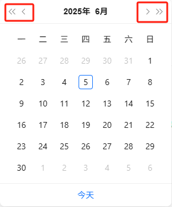

输入网页对象：待切换内容所在网页对象指定内容：传入期望点击的元素文本内容，比如2025年，或6月对照元素：用于比对与指定内容之间大小，判断切换的方向，对照元素的文本内容需要是数字，可以包含年、月字样，如2025年或6月向前切换_元素：用于向前/上切换的按钮元素向后切换_元素：用于向后/下切换的按钮元素
# 输出

无
# 使用说明
## 1、功能

用于网页，基于比对大小判断切换方向（元素的文本内容需要是数字，可以包含年、月字样，如2025年或6月）

## 2、采集字段

无
## 3、输出结果

<Info>
  使用指令过程中遇到问题？前往 [八爪鱼RPA 开发者社区问答板块](https://rpa.bazhuayu.com/community/questions) 提问，获取官方与社区帮助。
</Info>
