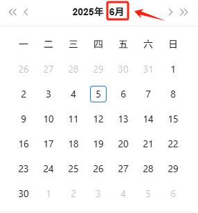
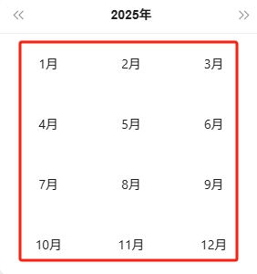

# 输入​

•网页对象：待点击元素所在网页对象​

•指定内容：传入期望点击的元素文本内容，例如：4月​

•点击元素：可选，当相似元素组需要通过点击元素才出现对应相似元素组/下拉框时，请传入对应元素​
​

•相似元素组：传入包含期望元素的相似元素组​

# 输出​

无​
# 使用说明​
## 1、功能​

用于网页，循环相似元素组，当元素内容与指定内容相同时，选中该元素​
​

## 2、采集字段​

无​
## 3、输出结果​

<Info>
  使用指令过程中遇到问题？前往 [八爪鱼RPA 开发者社区问答板块](https://rpa.bazhuayu.com/community/questions) 提问，获取官方与社区帮助。
</Info>
