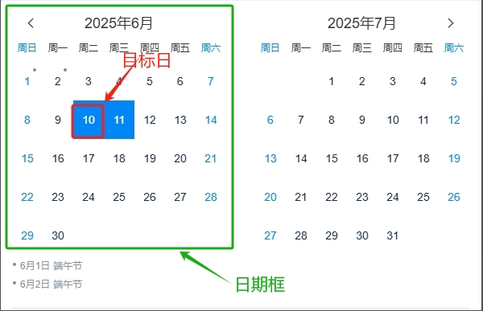

输入网页对象：操作元素所在网页对象日期框：Web元素，包含1-31号的日期大框目标日：年月日中的日，要与日期框中的文本格式一致点击方式：单选框，单选/双选
# 输出

无
# 使用说明
## 1、功能

该指令实现网页中的日期选择

## 2、采集字段

无
## 3、输出结果

<Info>
  使用指令过程中遇到问题？前往 [八爪鱼RPA 开发者社区问答板块](https://rpa.bazhuayu.com/community/questions) 提问，获取官方与社区帮助。
</Info>
