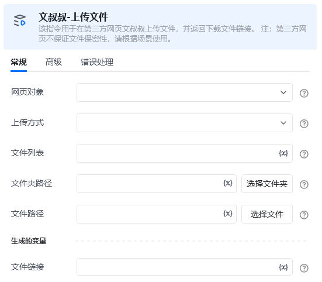

# 一.功能描述

该指令用于在第三方网页文叔叔上传文件，并返回下载文件链接。

注：第三方网页不保证文件保密性，请根据场景使用，文件链接仅保存24小时。

官方网址：https://www.wenshushu.cn/

# 二.使用说明
## 输入参数

<strong>网页对象：</strong>

传入任意已打开的网页对象，如：百度（指令会跳转到文叔叔上传页面）。

<strong>上传方式：</strong>

选择上传的方式（单/多个文件、整个文件夹）。

<strong>文件路径：</strong>

【上传方式】选择【单个文件】：选择上传的文件。

<strong>文件列表：</strong>

【上传方式】选择【多个文件】：传入待上传文件的绝对路径列表。。

<strong>文件夹路径：</strong>

【上传方式】选择【整个文件夹】：选择需要上传的文件夹。
## 高级

<strong>等待上传时间：</strong>

请输入等待上传时间，默认300秒。
## 输出参数：

<strong>文件链接：</strong>

返回文件下载链接。
# 三.使用演示

<Info>
  使用指令过程中遇到问题？前往 [八爪鱼RPA 开发者社区问答板块](https://rpa.bazhuayu.com/community/questions) 提问，获取官方与社区帮助。
</Info>
