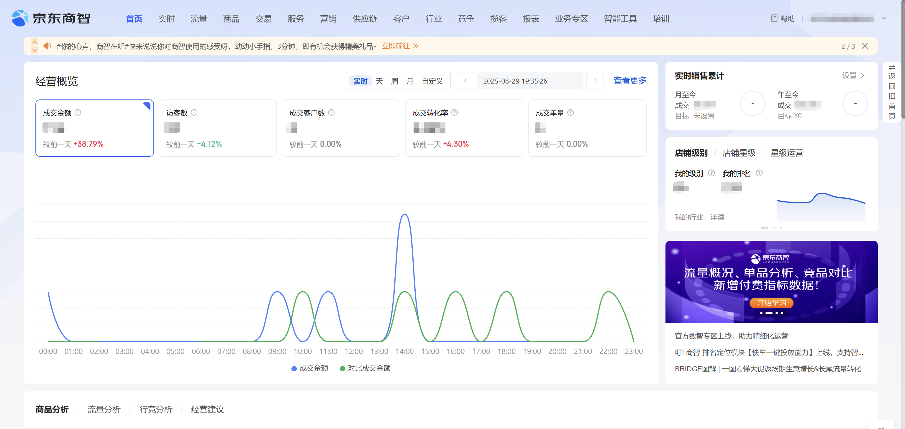

# 一.功能描述

该指令实现了登录京东商智商家版登录
# 二.使用参数说明
## 1.输入参数

网页对象：京东商智（商家版）登陆页面的网页对象

账号：需要登录的账号

密码：需要登录账号的密码

偏移量：当滑块按钮移动距离不能完成拼图时，可以通过偏移量进行微调，如每次滑动距离都差3px，则输入3，滑动距离超过4px，则输入-4
## 2.输出参数

已登录网页: 输出登录完成的网页对象
# 三.结果样例及展示说明

使用前：

使用后：

<Info>
  使用指令过程中遇到问题？前往 [八爪鱼RPA 开发者社区问答板块](https://rpa.bazhuayu.com/community/questions) 提问，获取官方与社区帮助。
</Info>
